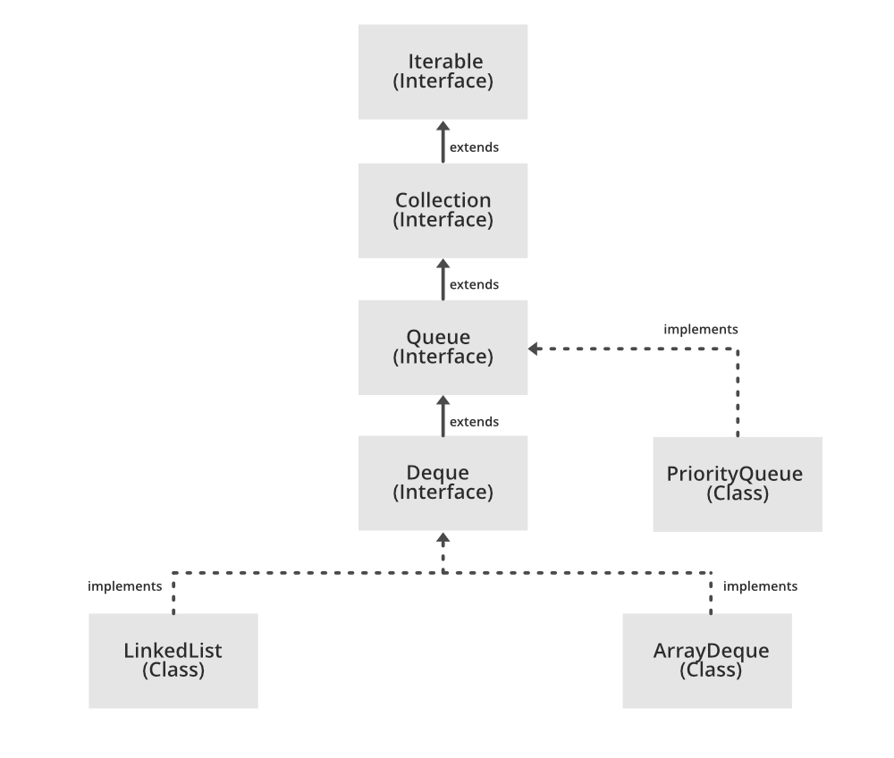

# Queue interface


```
public interface Queue<E> extends Collection<E>
```

A collection designed for holding elements prior to processing. Besides basic `Collection` operations, queues provide additional insertion, extraction, and inspection operations. Each of these methods exists in two forms: one throws an exception if the operation fails, the other returns a special value (either `null` or `false`, depending on the operation). The latter form of the insert operation is designed specifically for use with capacity-restricted `Queue` implementations; in most implementations, insert operations cannot fail.


| Concurrency | Throws exception  | Returns special value |
|---|---|---|
| Insert  | `add(e)`  | `offer(e)` |
| Remove  | `remove()`  | `poll()` |
| Examine | `element()`  | `peek()` |

Queues typically, but do not necessarily, order elements in a FIFO (first-in-first-out) manner. Among the exceptions are priority queues, which order elements according to a supplied comparator, or the elements' natural ordering, and LIFO queues (or stacks) which order the elements LIFO (last-in-first-out). Whatever the ordering used, the *head* of the queue is that element which would be removed by a call to `remove()` or `poll()`. In a FIFO queue, all new elements are inserted at the *tail* of the queue. Other kinds of queues may use different placement rules. Every `Queue` implementation must specify its ordering properties.<sup>[1](https://docs.oracle.com/javase/7/docs/api/java/util/Queue.html#:~:text=A%20collection%20designed,its%20ordering%20properties.)</sup>

The `Queue` interface does not define the *blocking queue methods*, which are common in concurrent programming. These methods, which wait for elements to appear or for space to become available, are defined in the `BlockingQueue` interface, which extends this interface.

`Queue` implementations generally do not allow insertion of `null` elements, although some implementations, such as `LinkedList`, do not prohibit insertion of `null`. Even in the implementations that permit it, `null` should not be inserted into a `Queue`, as `null` is also used as a special return value by the `poll` method to indicate that the queue contains no elements.

`Queue` implementations generally do not define element-based versions of methods `equals` and `hashCode` but instead inherit the identity based versions from class `Object`, because element-based equality is not always well-defined for queues with the same elements but different ordering properties.<sup>[2](https://docs.oracle.com/javase/7/docs/api/java/util/Queue.html#:~:text=The%20Queue%20interface,different%20ordering%20properties.)</sup>

## Most used Implementing Classes
- [`PriorityQueue`](https://docs.oracle.com/javase/7/docs/api/java/util/PriorityQueue.html): An unbounded priority queue based on a priority heap. The elements of the priority queue are ordered according to their natural ordering, or by a `Comparator` provided at queue construction time, depending on which constructor is used. A priority queue does not permit `null` elements. A priority queue relying on natural ordering also does not permit insertion of non-comparable objects (doing so may result in `ClassCastException`).<sup>[3](https://docs.oracle.com/javase/7/docs/api/java/util/PriorityQueue.html#:~:text=An%20unbounded%20priority,non%2Dcomparable%20objects%20)</sup>
- [`LinkedList`](https://docs.oracle.com/javase/7/docs/api/java/util/LinkedList.html): Doubly-linked list implementation of the `List` and `Deque` interfaces. Implements all optional list operations, and permits all elements (including `null`). All of the operations perform as could be expected for a doubly-linked list. Operations that index into the list will traverse the list from the beginning or the end, whichever is closer to the specified index. <sup>[4](https://docs.oracle.com/javase/7/docs/api/java/util/LinkedList.html#:~:text=Doubly%2Dlinked%20list,the%20specified%20index.)</sup>
- [`PriorityBlockingQueue`](https://docs.oracle.com/javase/7/docs/api/java/util/concurrent/PriorityBlockingQueue.html):
An unbounded blocking queue that uses the same ordering rules as class `PriorityQueue` and supplies blocking retrieval operations. While this queue is logically unbounded, attempted additions may fail due to resource exhaustion (causing `OutOfMemoryError`). This class does not permit `null` elements. A priority queue relying on natural ordering also does not permit insertion of non-comparable objects (doing so results in `ClassCastException`).
<sup>[5](https://docs.oracle.com/javase/7/docs/api/java/util/concurrent/PriorityBlockingQueue.html#:~:text=An%20unbounded%20blocking,non%2Dcomparable%20objects)</sup>

# Links
[Java Queue Interface](https://www.programiz.com/java-programming/queue)

[Interface Queue](https://docs.oracle.com/javase/7/docs/api/java/util/Queue.html)
  
# Further reading
[Java Queue – Queue in Java](https://www.digitalocean.com/community/tutorials/java-queue)

[Queue Interface In Java](https://www.geeksforgeeks.org/queue-interface-java/)
