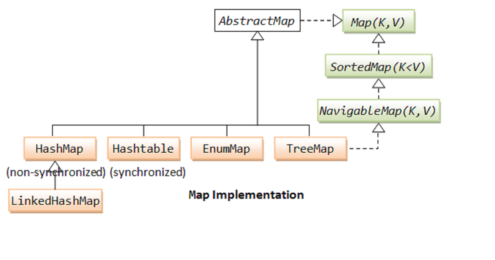

# Map interface

An object that maps keys to values. A map cannot contain duplicate keys; each key can map to at most one value.

This interface takes the place of the `Dictionary` class, which was a totally abstract class rather than an interface.

The `Map` interface provides three *collection views*, which allow a map's contents to be viewed as a set of keys, collection of values, or set of key-value mappings. The *order* of a map is defined as the order in which the iterators on the map's collection views return their elements. Some map implementations, like the `TreeMap` class, make specific guarantees as to their order; others, like the `HashMap` class, do not.

Note: great care must be exercised if mutable objects are used as map keys. The behavior of a map is not specified if the value of an object is changed in a manner that affects equals comparisons while the object is a key in the map. A special case of this prohibition is that it is not permissible for a map to contain itself as a key. While it is permissible for a map to contain itself as a value, extreme caution is advised: the `equals` and `hashCode` methods are no longer well defined on such a map.

The "destructive" methods contained in this interface, that is, the methods that modify the map on which they operate, are specified to throw `UnsupportedOperationException` if this map does not support the operation. If this is the case, these methods may, but are not required to, throw an `UnsupportedOperationException` if the invocation would have no effect on the map. For example, invoking the `putAll(Map)` method on an unmodifiable map may, but is not required to, throw the exception if the map whose mappings are to be "superimposed" is empty.

Some map implementations have restrictions on the keys and values they may contain. For example, some implementations prohibit `null` keys and values, and some have restrictions on the types of their keys. Attempting to insert an ineligible key or value throws an unchecked exception, typically `NullPointerException` or `ClassCastException`. Attempting to query the presence of an ineligible key or value may throw an exception, or it may simply return `false`; some implementations will exhibit the former behavior and some will exhibit the latter. More generally, attempting an operation on an ineligible key or value whose completion would not result in the insertion of an ineligible element into the map may throw an exception or it may succeed, at the option of the implementation. Such exceptions are marked as "optional" in the specification for this interface.

Many methods in Collections Framework interfaces are defined in terms of the `equals` method. For example, the specification for the `containsKey(Object key)` method says: "returns true if and only if this map contains a mapping for a key `k` such that (`key==null ? k==null : key.equals(k)`)." This specification should not be construed to imply that invoking `Map.containsKey` with a non-null argument key will cause `key.equals(k)` to be invoked for any key `k`. Implementations are free to implement optimizations whereby the equals invocation is avoided, for example, by first comparing the hash codes of the two keys. (The `Object.hashCode()` specification guarantees that two objects with unequal hash codes cannot be equal.) More generally, implementations of the various Collections Framework interfaces are free to take advantage of the specified behavior of underlying Object methods wherever the implementor deems it appropriate.

Some map operations which perform recursive traversal of the map may fail with an exception for self-referential instances where the map directly or indirectly contains itself. This includes the `clone()`, `equals()`, `hashCode()` and `toString()` methods. Implementations may optionally handle the self-referential scenario, however most current implementations do not do so.

## Most used implementing classes
- **HashMap**. Hash table based implementation of the `Map` interface. This implementation provides all of the optional map operations, and permits `null` values and the `null` key. (The `HashMap` class is roughly equivalent to `Hashtable`, except that it is unsynchronized and permits nulls.) This class makes no guarantees as to the order of the map; in particular, it does not guarantee that the order will remain constant over time. 

- **TreeMap**. A Red-Black tree based `NavigableMap` implementation. The map is sorted according to the natural ordering of its keys, or by a `Comparator` provided at map creation time, depending on which constructor is used. This implementation provides guaranteed `log(n)` time cost for the `containsKey`, `get`, `put` and `remove` operations.

- **Hashtable**. This class implements a hash table, which maps keys to values. Any non-null object can be used as a key or as a value. Unlike the new collection implementations, `Hashtable` is synchronized. If a thread-safe implementation is not needed, it is recommended to use `HashMap` in place of `Hashtable`. If a thread-safe highly-concurrent implementation is desired, then it is recommended to use `ConcurrentHashMap` in place of `Hashtable`.

- **LinkedHashMap**. Hash table and linked list implementation of the `Map` interface, with predictable iteration order. This implementation differs from `HashMap` in that it maintains a doubly-linked list running through all of its entries. This linked list defines the iteration ordering, which is normally the order in which keys were inserted into the map (insertion-order). Note that insertion order is not affected if a key is *re-inserted* into the map.

- **ConcurrentHashMap**. A hash table supporting full concurrency of retrievals and high expected concurrency for updates. This class obeys the same functional specification as `Hashtable`, and includes versions of methods corresponding to each method of `Hashtable`. However, even though all operations are thread-safe, retrieval operations do *not* entail locking, and there is *not* any support for locking the entire table in a way that prevents all access. This class is fully interoperable with `Hashtable` in programs that rely on its thread safety but not on its synchronization details.

- **EnumMap**. A specialized `Map` implementation for use with enum type keys. All of the keys in an enum map must come from a single enum type that is specified, explicitly or implicitly, when the map is created. Enum maps are represented internally as arrays. This representation is extremely compact and efficient.

# Links
https://docs.oracle.com/javase/8/docs/api/java/util/Map.html  
https://docs.oracle.com/javase/8/docs/api/java/util/HashMap.html  
https://docs.oracle.com/javase/8/docs/api/java/util/TreeMap.html  
https://docs.oracle.com/javase/8/docs/api/java/util/Hashtable.html  
https://docs.oracle.com/javase/8/docs/api/java/util/concurrent/ConcurrentHashMap.html  
https://docs.oracle.com/javase/7/docs/api/java/util/EnumMap.html  
https://docs.oracle.com/javase/8/docs/api/java/util/LinkedHashMap.html  
https://www.java67.com/2019/09/how-to-combine-two-map-in-java-example.html

# Next questions
[How HashMap works?](https://github.com/Kirchhoff-/Android-Interview-Questions/blob/master/Java/How%20HashMap%20works.md)  
[What do you know about TreeMap?](https://github.com/Kirchhoff-/Android-Interview-Questions/blob/master/Java/What%20do%20you%20know%20about%20TreeMap.md)  
[What do you know about Hashtable?](https://github.com/Kirchhoff-/Android-Interview-Questions/blob/master/Java/What%20do%20you%20know%20about%20Hashtable.md)  
[What do you know about ConcurrentHashMap?](https://github.com/Kirchhoff-/Android-Interview-Questions/blob/master/Java/What%20do%20you%20know%20about%20ConcurrentHashMap.md)  
[What do you know about EnumMap?](https://github.com/Kirchhoff-/Android-Interview-Questions/blob/master/Java/What%20do%20you%20know%20about%20EnumMap.md)  
[What do you know about LinkedHashMap?](https://github.com/Kirchhoff-/Android-Interview-Questions/blob/master/Java/What%20do%20you%20know%20about%20LinkedHashMap.md)  
