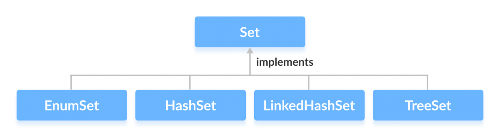

# Set interface

A collection that contains no duplicate elements. More formally, sets contain no pair of elements `e1` and `e2` such that `e1.equals(e2)`, and at most one `null` element. As implied by its name, this interface models the mathematical *set* abstraction.

The `Set` interface places additional stipulations, beyond those inherited from the `Collection` interface, on the contracts of all constructors and on the contracts of the `add`, `equals` and `hashCode` methods. Declarations for other inherited methods are also included here for convenience. (The specifications accompanying these declarations have been tailored to the `Set` interface, but they do not contain any additional stipulations.)

The additional stipulation on constructors is, not surprisingly, that all constructors must create a set that contains no duplicate elements (as defined above).

**Note**: Great care must be exercised if mutable objects are used as set elements. The behavior of a set is not specified if the value of an object is changed in a manner that affects `equals` comparisons while the object is an element in the set. A special case of this prohibition is that it is not permissible for a set to contain itself as an element.

Some set implementations have restrictions on the elements that they may contain. For example, some implementations prohibit `null` elements, and some have restrictions on the types of their elements. Attempting to add an ineligible element throws an unchecked exception, typically `NullPointerException` or `ClassCastException`. Attempting to query the presence of an ineligible element may throw an exception, or it may simply return `false`; some implementations will exhibit the former behavior and some will exhibit the latter. More generally, attempting an operation on an ineligible element whose completion would not result in the insertion of an ineligible element into the set may throw an exception or it may succeed, at the option of the implementation. Such exceptions are marked as "optional" in the specification for this interface.

## Most used implementing classes
- **HashSet**. This class implements the `Set` interface, backed by a hash table (actually a `HashMap` instance). It makes no guarantees as to the iteration order of the set; in particular, it does not guarantee that the order will remain constant over time. This class permits the `null` element.

- **TreeSet**. `TreeSet` class implements the `Set` interface that uses a tree for storage. It inherits `AbstractSet` class and implements the `NavigableSet` interface. The elements are ordered using their natural ordering, or by a `Comparator` provided at set creation time, depending on which constructor is used.

- **LinkedHashSet**. Hash table and linked list implementation of the `Set` interface, with predictable iteration order. This implementation differs from `HashSet` in that it maintains a doubly-linked list running through all of its entries. This linked list defines the iteration ordering, which is the order in which elements were inserted into the set (*insertion-order*). Note that insertion order is *not* affected if an element is *re-inserted* into the set. (An element `e` is reinserted into a set `s` if `s.add(e)` is invoked when `s.contains(e)` would return `true` immediately prior to the invocation.)

- **EnumSet**. A specialized `Set` implementation for use with enum types. All of the elements in an enum set must come from a single enum type that is specified, explicitly or implicitly, when the set is created. Enum sets are represented internally as bit vectors. This representation is extremely compact and efficient. The space and time performance of this class should be good enough to allow its use as a high-quality, typesafe alternative to traditional int-based "bit flags." Even bulk operations (such as `containsAll` and `retainAll`) should run very quickly if their argument is also an enum set.

# Links
https://docs.oracle.com/javase/7/docs/api/java/util/Set.html  
https://docs.oracle.com/javase/7/docs/api/java/util/HashSet.html  
https://docs.oracle.com/javase/7/docs/api/java/util/TreeSet.html  
https://docs.oracle.com/javase/7/docs/api/java/util/LinkedHashSet.html  
https://docs.oracle.com/javase/7/docs/api/java/util/EnumSet.html  
https://www.programiz.com/java-programming/set

# Next questions
[What do you know about EnumSet?](https://github.com/Kirchhoff-/Android-Interview-Questions/blob/master/Java/What%20do%20you%20know%20about%20EnumSet.md)  
[What do you know about HashSet](https://github.com/Kirchhoff-/Android-Interview-Questions/blob/master/Java/What%20do%20you%20know%20about%20HashSet.md)  
[What do you know about LinkedHashSet](https://github.com/Kirchhoff-/Android-Interview-Questions/blob/master/Java/What%20do%20you%20know%20about%20LinkedHashSet.md)  
[What do you know about TreeSet](https://github.com/Kirchhoff-/Android-Interview-Questions/blob/master/Java/What%20do%20you%20know%20about%20TreeSet.md)

# Further reading
[The Set Interface](https://docs.oracle.com/javase/tutorial/collections/interfaces/set.html)
