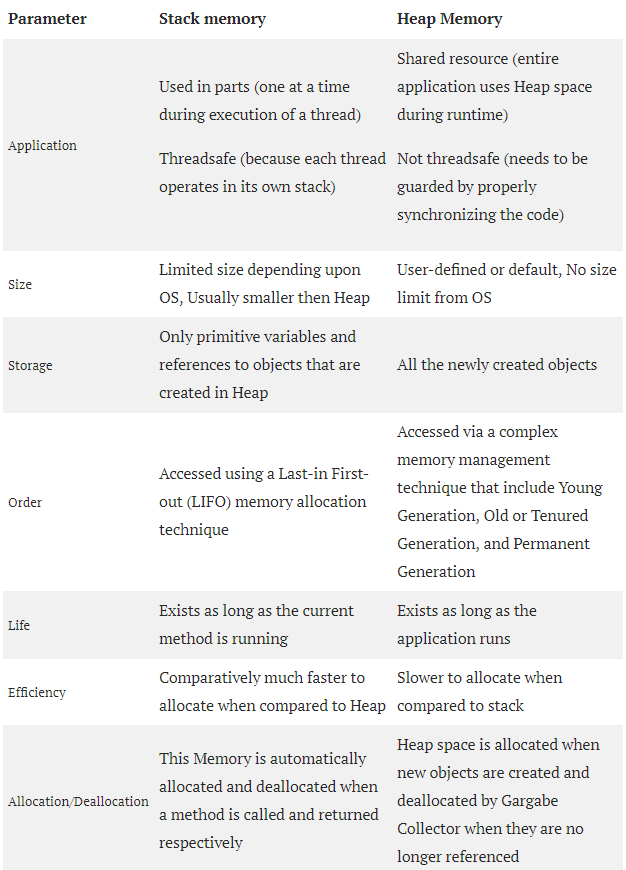
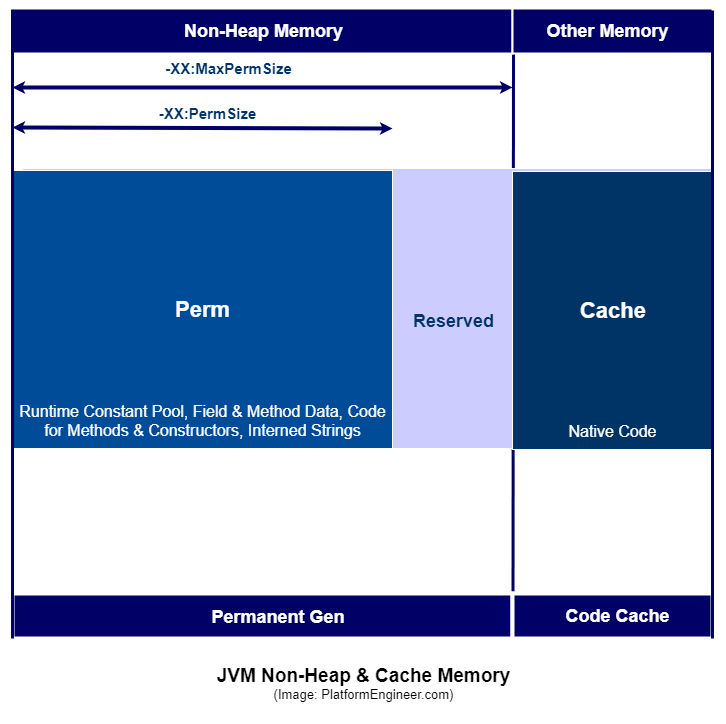

# Java memory model
The Java memory model specifies how the Java virtual machine works with the computer's memory (RAM). The Java virtual machine is a model of a whole computer so this model naturally includes a memory model - AKA the Java memory model.

It is very important to understand the Java memory model if you want to design correctly behaving concurrent programs. The Java memory model specifies how and when different threads can see values written to shared variables by other threads, and how to synchronize access to shared variables when necessary.


Generally, memory is divided into two big parts: the stack and the heap. Also JVM has non-heap memory. 

## Stack and Heap 

Stack memory is responsible for holding references to heap objects and for storing value types (also known in Java as primitive types), which hold the value itself rather than a reference to an object from the heap.

Each thread running in the Java virtual machine has its own thread stack. The thread stack contains information about what methods the thread has called to reach the current point of execution. A thread can only access it's own thread stack. Local variables created by a thread are invisible to all other threads than the thread who created it. Even if two threads are executing the exact same code, the two threads will still create the local variables of that code in each their own thread stack. Thus, each thread has its own version of each local variable.

The heap memory contains all objects created in your Java application, regardless of what thread created the object. Those are referenced by the variables from the stack. For example, let’s analyze what happens in the following line of code:

```
StringBuilder builder = new StringBuilder();
```

The `new` keyword is responsible for ensuring that there is enough free space on heap, creating an object of the `StringBuilder` type in memory and referring to it via the "builder" reference, which goes on the stack.

There exists only one heap memory for each running JVM process. Therefore, this is a shared part of memory regardless of how many threads are running. 

Objects on the heap can be accessed by all threads that have a reference to the object. When a thread has access to an object, it can also get access to that object's member variables. If two threads call a method on the same object at the same time, they will both have access to the object's member variables, but each thread will have its own copy of the local variables. 
Here is a diagram illustrating the points above:  


Two threads have a set of local variables. One of the local variables (Local Variable 2) point to a shared object on the heap (Object 3). The two threads each have a different reference to the same object. Their references are local variables and are thus stored in each thread's thread stack (on each). The two different references point to the same object on the heap, though. 
Differences between Stack vs Heap:  



## Non-Heap Memory
PermGen (Permanent Generation) is a special heap space separated from the main memory heap. The JVM keeps track of loaded class metadata in the PermGen. Additionally, the JVM stores all the static content in this memory section. This includes all the static methods, primitive variables, and references to the static objects. PermGen is replaced by Metaspace since Java 8. The most significant difference is how it handles memory allocation. Specifically, this native memory region grows automatically by default.



## Links
https://docs.oracle.com/cd/E13150_01/jrockit_jvm/jrockit/geninfo/diagnos/garbage_collect.html  
https://medium.com/platform-engineer/understanding-java-memory-model-1d0863f6d973  
https://dzone.com/articles/java-memory-management  
http://tutorials.jenkov.com/java-concurrency/java-memory-model.html  
https://www.baeldung.com/java-permgen-metaspace  
