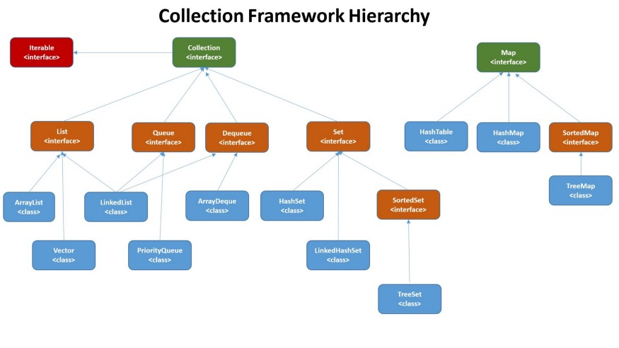

# Java Collections Framework
The Collection in Java is a framework that provides an architecture to store and manipulate the group of objects. Java Collections can achieve all the operations that you perform on a data such as searching, sorting, insertion, manipulation, and deletion.

## Iterator and Iterable
`Iterator` interface provides the facility of iterating the elements in a forward direction only. There are only three methods in the `Iterator` interface. They are:

| Method  | Description  |
|---|---|
| `public boolean hasNext()` | It returns true if the iterator has more elements otherwise it returns false. |
| `public Object next()` | It returns the element and moves the cursor pointer to the next element. |
| `public void remove()` | It removes the last elements returned by the iterator. It is less used. |

The `Iterable` interface is the root interface for all the collection classes. The `Collection` interface extends the `Iterable` interface and therefore all the subclasses of `Collection` interface also implement the `Iterable` interface. It contains only one abstract method: 
`Iterator<T> iterator()`
It returns the iterator over the elements of type T.

## Collection
The root interface in the collection hierarchy. A collection represents a group of objects, known as its elements. Some collections allow duplicate elements and others do not. Some are ordered and others unordered. The JDK does not provide any direct implementations of this interface, it provides implementations of more specific subinterfaces like `Set` and `List`. This interface is typically used to pass collections around and manipulate them where maximum generality is desired. 

`Collection` interface provides all general purpose methods which all collections classes must support (or throw `UnsupportedOperationException`). It extends `Iterable` interface which adds support for iterating over collection elements using the "for-each loop" statement.

## List
An ordered collection (also known as a sequence). The user of this interface has precise control over where in the list each element is inserted. The user can access elements by their integer index (position in the list), and search for elements in the list. It can have duplicate values. There are various methods in `List` interface that can be used to insert, delete, and access the elements from the list. `List` interface is implemented by the classes: `ArrayList`, `LinkedList`, `Vector`, and `Stack`.

## Set
Sets represents a collection of sorted elements. Sets do not allow the duplicate elements. `Set` interface does not provides no guarantee to return the elements in any predictable order; though some `Set` implementations store elements in their natural ordering and guarantee this order.

Some useful classes which implement `Set` interface are – `EnumSet`, `HashSet`, `LinkedHashSet` and `TreeSet`.

## Map
The `Map` interface enable us to store data in key-value pairs (keys should be immutable). A map cannot contain duplicate keys; each key can map to at most one value.

The `Map` interface provides three collection views, which allow a map’s contents to be viewed as a set of keys, collection of values, or set of key-value mappings. Some map implementations, like the `TreeMap` class, make specific guarantees as to their order; others, like the `HashMap` class, do not.

Some useful classes which implement `Map` interface are – `ConcurrentHashMap`, `ConcurrentSkipListMap`, `EnumMap`, `HashMap`, `Hashtable`, `IdentityHashMap`, `LinkedHashMap`, `Properties`, `TreeMap` and `WeakHashMap`.

## Queue 
A queue data structure is intended to hold the elements (put by producer threads) prior to processing by consumer thread(s). Besides basic Collection operations, queues provide additional insertion, extraction, and inspection operations.

Queues typically, but do not necessarily, order elements in a FIFO (first-in-first-out) manner. One such exception is priority queue which order elements according to a supplied `Comparator`, or the elements’ natural ordering.

In general, queues do not support blocking insertion or retrieval operations. Blocking queue implementations classes implement `BlockingQueue` interface.

Some common known classes implementing this interface are `PrioriyQueue` and `LinkedList`.

## Deque
A double ended queue (pronounced “deck“) that supports element insertion and removal at both ends. When a deque is used as a queue, FIFO (First-In-First-Out) behavior results. When a deque is used as a stack, LIFO (Last-In-First-Out) behavior results.

Some common known classes implementing this interface are `ArrayDeque`, `ConcurrentLinkedDeque`, `LinkedBlockingDeque` and `LinkedList`.

## Links  
https://medium.com/@sivacynixit/java-collections-hierarchy-with-examples-3ff0b1c44d52  
https://docs.oracle.com/javase/8/docs/api/java/util/Collection.html  
https://docs.oracle.com/javase/8/docs/api/java/util/List.html  
https://docs.oracle.com/javase/8/docs/api/java/util/Map.html  
https://docs.oracle.com/javase/8/docs/api/java/util/Set.html  
https://www.javatpoint.com/collections-in-java  
https://howtodoinjava.com/java-collections/  
