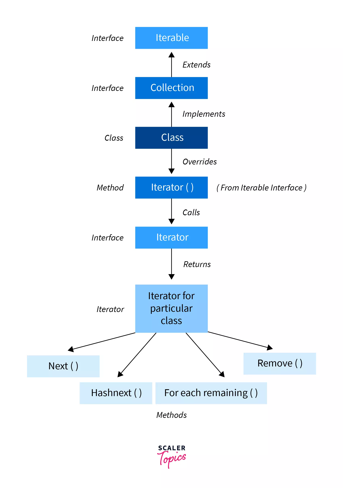

# Iterator interface


In Java, an `Iterator` is one of the Java cursors. Java `Iterator` is an interface that is practiced in order to iterate over a collection of Java object components entirety one by one. It belongs to `java.util` package. <sup>[1](https://www.javatpoint.com/java-iterator#:~:text=In%20Java%2C%20an,java.util%20package.)</sup>

The Java `Iterator` is also known as the **universal cursor** of Java as it is appropriate for all the classes of the Collection framework. The Java `Iterator` also helps in the operations like READ and REMOVE. <sup>[2](https://www.javatpoint.com/java-iterator#:~:text=The%20Java%20Iterator%20is%20also%20known%20as%20the%20universal%20cursor%20of%20Java%20as%20it%20is%20appropriate%20for%20all%20the%20classes%20of%20the%20Collection%20framework.%20The%20Java%20Iterator%20also%20helps%20in%20the%20operations%20like%20READ%20and%20REMOVE.)</sup>

## [Methods of `Iterator`](https://www.programiz.com/java-programming/iterator#:~:text=elements%20of%20collections.-,Methods%20of%20Iterator,-The)
The `Iterator` interface provides 4 methods that can be used to perform various operations on elements of collections:
- `hasNext()` - returns `true` if there exists an element in the collection;
- `next()` - returns the next element of the collection;
- `remove()` - removes the last element returned by the `next()`;
- `forEachRemaining()` - performs the specified action for each remaining element of the collection.

## [Example: Implementation of `Iterator`](https://www.programiz.com/java-programming/iterator#:~:text=Example%3A%20Implementation%20of%20Iterator)
In the example below, we have implemented the `hasNext()`, `next()`, `remove()` and `forEachRemining()` methods of the `terator` interface in an array list.
```
import java.util.ArrayList;
import java.util.Iterator;

class Main {
    public static void main(String[] args) {
        // Creating an ArrayList
        ArrayList<Integer> numbers = new ArrayList<>();
        numbers.add(1);
        numbers.add(3);
        numbers.add(2);
        System.out.println("ArrayList: " + numbers);

        // Creating an instance of Iterator
        Iterator<Integer> iterate = numbers.iterator();

        // Using the next() method
        int number = iterate.next();
        System.out.println("Accessed Element: " + number);

        // Using the remove() method
        iterate.remove();
        System.out.println("Removed Element: " + number);

        System.out.print("Updated ArrayList: ");

        // Using the hasNext() method
        while(iterate.hasNext()) {
            // Using the forEachRemaining() method
            iterate.forEachRemaining((value) -> System.out.print(value + ", "));
        }
    }
}
```

Output:
```
ArrayList: [1, 3, 2]
Acessed Element: 1
Removed Element: 1
Updated ArrayList: 3, 2,
```

## [Advantage of `Iterator` in Java](https://www.scientecheasy.com/2020/09/java-iterator.html/#:~:text=Advantage%20of%20Iterator%20in%20Java)
- An iterator can be used with any collection classes;
- We can perform both read and remove operations;
- It acts as a universal cursor for collection API.

## [Limitation of `Iterator` in Java](https://www.scientecheasy.com/2020/09/java-iterator.html/#:~:text=Limitation%20of%20Iterator%20in%20Java)
- We can perform either read operation or remove operation;
- We cannot perform the replacement of new objects.

# Links
[`Iterable` Interface in Java](https://www.scaler.com/topics/java/iterable-interface-in-java/)

[`Iterator` in Java](https://www.javatpoint.com/java-iterator)

[Java `Iterator` Interface](https://www.programiz.com/java-programming/iterator)

[`Iterator` in Java | Methods, Example](https://www.scientecheasy.com/2020/09/java-iterator.html/)

# Next questions
[What is the difference between a `Stream` and an `Iterator`?](https://github.com/Kirchhoff-/Android-Interview-Questions/blob/master/Java/What%20is%20the%20difference%20between%20a%20Stream%20and%20an%20Iterator.md)

# Further Reading
[`Iterator` Interface In Java](https://www.geeksforgeeks.org/iterator-interface-in-java/)

[Java `Iterable` Interface: `Iterator`, `ListIterator`, and `Spliterator`](https://stackabuse.com/java-iterable-interface-iterator-listiterator-and-spliterator/)
