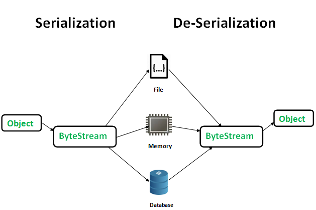

# Serializable interface
Serialization is a mechanism of converting the state of an object into a byte stream. Deserialization is the reverse process where the byte stream is used to recreate the actual Java object in memory. This mechanism is used to persist the object.



The Java `Serializable` interface (`java.io.Serializable`) is a marker interface your classes must implement if they are to be serialized and deserialized. Classes that do not implement this interface will not have any of their state serialized or deserialized. All subtypes of a serializable class are themselves serializable. The serialization interface has no methods or fields and serves only to identify the semantics of being serializable.

To allow subtypes of non-serializable classes to be serialized, the subtype may assume responsibility for saving and restoring the state of the supertype's public, protected, and (if accessible) package fields. The subtype may assume this responsibility only if the class it extends has an accessible no-arg constructor to initialize the class's state. It is an error to declare a class Serializable if this is not the case. The error will be detected at runtime.

During deserialization, the fields of non-serializable classes will be initialized using the public or protected no-arg constructor of the class. A no-arg constructor must be accessible to the subclass that is serializable. The fields of serializable subclasses will be restored from the stream.

When traversing a graph, an object may be encountered that does not support the `Serializable` interface. In this case the `NotSerializableException` will be thrown and will identify the class of the non-serializable object.

Classes that require special handling during the serialization and deserialization process must implement special methods with these exact signatures:
```
private void writeObject(java.io.ObjectOutputStream out) throws IOException
private void readObject(java.io.ObjectInputStream in) throws IOException, ClassNotFoundException;
private void readObjectNoData()throws ObjectStreamException;
```

The `writeObject()` method is responsible for writing the state of the object for its particular class so that the corresponding `readObject()` method can restore it. The default mechanism for saving the Object's fields can be invoked by calling `out.defaultWriteObject()`. The method does not need to concern itself with the state belonging to its superclasses or subclasses. State is saved by writing the individual fields to the `ObjectOutputStream` using the `writeObject` method or by using the methods for primitive data types supported by `DataOutput`.

The `readObject()` method is responsible for reading from the stream and restoring the classes fields. It may call `in.defaultReadObject` to invoke the default mechanism for restoring the object's non-static and non-transient fields. The `defaultReadObject` method uses information in the stream to assign the fields of the object saved in the stream with the correspondingly named fields in the current object. This handles the case when the class has evolved to add new fields. The method does not need to concern itself with the state belonging to its superclasses or subclasses. State is saved by writing the individual fields to the `ObjectOutputStream` using the `writeObject` method or by using the methods for primitive data types supported by `DataOutput`.

The `readObjectNoData()` method is responsible for initializing the state of the object for its particular class in the event that the serialization stream does not list the given class as a superclass of the object being deserialized. This may occur in cases where the receiving party uses a different version of the deserialized instance's class than the sending party, and the receiver's version extends classes that are not extended by the sender's version. This may also occur if the serialization stream has been tampered; hence, `readObjectNoData` is useful for initializing deserialized objects properly despite a "hostile" or incomplete source stream.

Points to remember:
- If a parent class has implemented `Serializable` interface then child class doesn’t need to implement it but vice-versa is not true;
- Only non-static data members are saved via Serialization process;
- `static` data members and `transient` data members are not saved via Serialization process.So, if you don’t want to save value of a non-static data member then make it `transient`;
- Constructor of object is never called when an object is deserialized.

## serialVersionUID
The serialization runtime associates with each serializable class a version number, called a `serialVersionUID`, which is used during deserialization to verify that the sender and receiver of a serialized object have loaded classes for that object that are compatible with respect to serialization. If the receiver has loaded a class for the object that has a different `serialVersionUID` than that of the corresponding sender's class, then deserialization will result in an `InvalidClassException`. A serializable class can declare its own `serialVersionUID` explicitly by declaring a field named `serialVersionUID` that must be `static`, `final`, and of type `long`:

```
ANY-ACCESS-MODIFIER static final long serialVersionUID = 42L;
```

If a serializable class does not explicitly declare a `serialVersionUID`, then the serialization runtime will calculate a default `serialVersionUID` value for that class based on various aspects of the class, as described in the Java Object Serialization Specification. However, it is *strongly recommended* that all serializable classes explicitly declare `serialVersionUID` values, since the default `serialVersionUID` computation is highly sensitive to class details that may vary depending on compiler implementations, and can thus result in unexpected `InvalidClassExceptions` during deserialization. Therefore, to guarantee a consistent `serialVersionUID` value across different java compiler implementations, a serializable class must declare an explicit `serialVersionUID` value. It is also strongly advised that explicit `serialVersionUID` declarations use the `private` modifier where possible, since such declarations apply only to the immediately declaring class--serialVersionUID fields are not useful as inherited members. Array classes cannot declare an explicit `serialVersionUID`, so they always have the default computed value, but the requirement for matching `serialVersionUID` values is waived for array classes.

## Links
https://docs.oracle.com/javase/7/docs/api/java/io/Serializable.html  
https://www.geeksforgeeks.org/serialization-in-java/  
http://tutorials.jenkov.com/java-io/serializable.html
