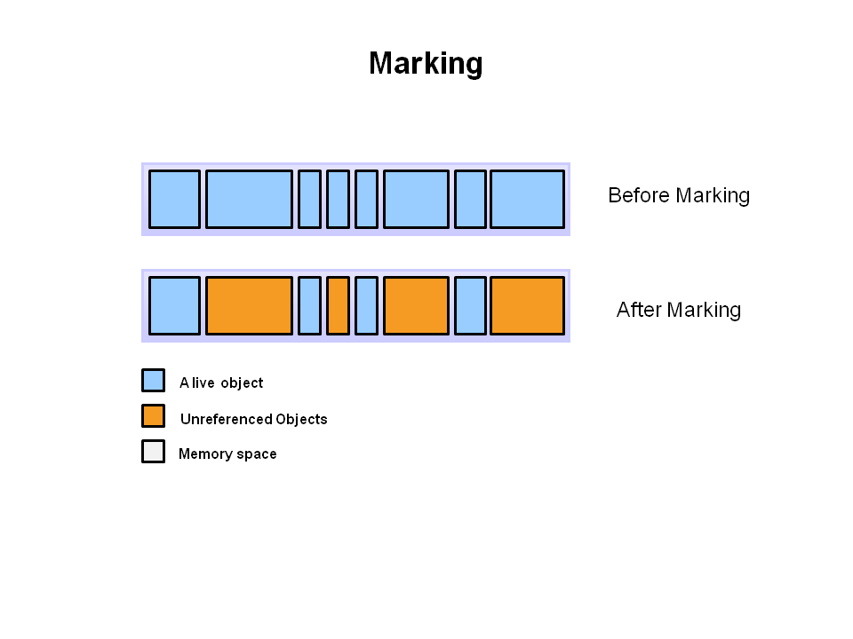
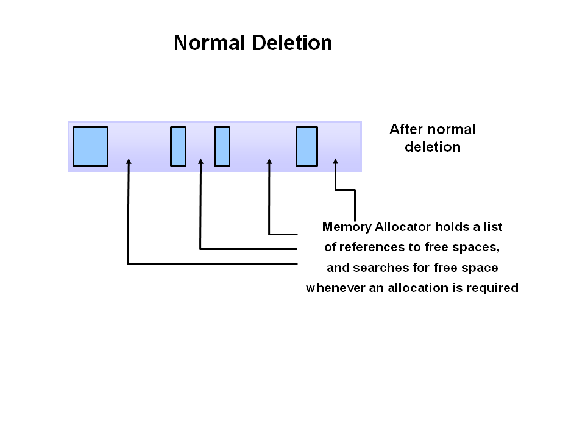
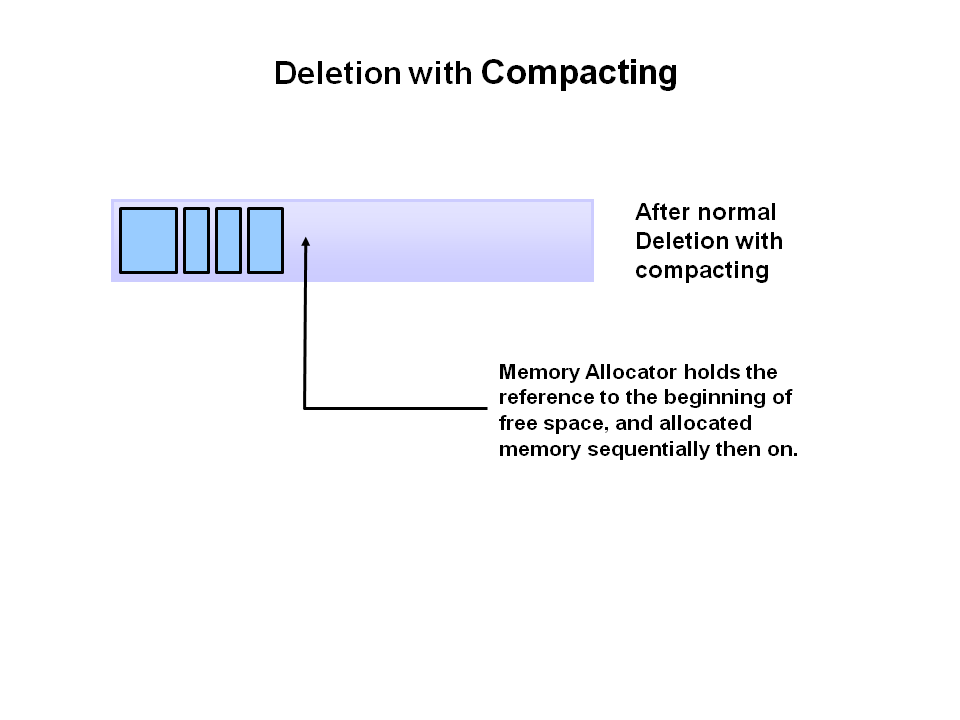

# Garbage Collection

Java garbage collection is the process by which Java programs perform automatic memory management. During the programs work objects are created on the heap, which is a portion of memory dedicated to the program. An in use object, or a referenced object, means that some part of your program still maintains a pointer to that object. An unused object, or unreferenced object, is no longer referenced by any part of your program. So the memory used by an unreferenced object can be reclaimed.

**Advantages**:
- No manual memory allocation/deallocation handling because unused memory space is automatically handled by GC
- No overhead of handling Dangling Pointer
- Automatic Memory Leak management (GC on its own can't guarantee the full proof solution to memory leaking, however, it takes care of a good portion of it)

**Disadvantages**:
- Since JVM has to keep track of object reference creation/deletion, this activity requires more CPU power besides the original application.
- Programmers have no control over the scheduling of CPU time dedicated to freeing objects that are no longer needed
- Using some GC implementations might result in application stopping unpredictably
- Automatized memory management will not be as efficient as the proper manual memory allocation/deallocation

## How Java Garbage Collection Works

1. **Marking**. This is where the garbage collector identifies which pieces of memory are in use and which are not.

Referenced objects are shown in blue. Unreferenced objects are shown in gold. All objects are scanned in the marking phase to make this determination. This can be a very time consuming process if all objects in a system must be scanned.

2. **Deletion**. Normal deletion removes unreferenced objects leaving referenced objects and pointers to free space.

The memory allocator holds references to blocks of free space where new object can be allocated.

3. **Compacting**. To further improve performance, in addition to deleting unreferenced objects, you can also compact the remaining referenced objects. By moving referenced object together, this makes new memory allocation much easier and faster.

## Generations

Garbage collectors implement a generational garbage collection strategy that categorizes objects by age, to enhance the performance of the JVM. Therefore, the heap is broken up into smaller parts or generations. The heap parts are: Young Generation, Old or Tenured Generation, and Permanent Generation.

- **Young Generation**: Where all new objects are allocated and aged. When the young generation fills up, this causes a minor garbage collection. Minor collections can be optimized assuming a high object mortality rate. A young generation full of dead objects is collected very quickly. Some surviving objects are aged and eventually move to the old generation.
- **Old Generation**: Objects that are long-lived are eventually moved from the Young Generation to the Old Generation. When objects are garbage collected from the Old Generation, it is a major garbage collection event.
- **Permanent Generation**: Contains metadata required by the JVM to describe the classes and methods used in the application. The permanent generation is populated by the JVM at runtime based on classes in use by the application. In addition, Java SE library classes and methods may be stored here.

## Garbage Collection Implementations

JVM has four types of GC implementations - Serial Garbage Collector, Parallel Garbage Collector, CMS Garbage Collector, G1 Garbage Collector.

- **Serial** - All garbage collection events are conducted serially in one thread. Compaction is executed after each garbage collection. Freezes all application threads when it runs.
- **Parallel** - Multiple threads are used for minor garbage collection. A single thread is used for major garbage collection and Old Generation compaction.  Freezes other application threads while performing GC.
- **CMS (Concurrent Mark Sweep)** - collects the tenured generation. It attempts to minimize the pauses due to garbage collection by doing most of the garbage collection work concurrently with the application threads. Normally the concurrent low pause collector does not copy or compact the live objects. A garbage collection is done without moving the live objects. Simply put, applications using this type of GC respond slower on average but do not stop responding to perform garbage collection.
- **G1 (Garbage First)** - The newest garbage collector is intended as a replacement for CMS. It is parallel and concurrent like CMS, but it works quite differently under the hood compared to the older garbage collectors.

## Finalization

Just before destroying an object, Garbage Collector calls `finalize()` method on the object to perform cleanup activities. Once `finalize()` method completes, Garbage Collector destroys that object. `finalize()` method is present in Object class with following prototype:

`protected void finalize() throws Throwable`

We can ovveride `finalize()` method for cleanup resources (close connection to database and etc.)

**Note**:
- The `finalize()` method is never invoked more than once for any given object.
- If an uncaught exception is thrown by the `finalize()` method, the exception is ignored and finalization of that object terminates.

## Links
https://www.oracle.com/webfolder/technetwork/tutorials/obe/java/gc01/index.html  
https://www.baeldung.com/jvm-garbage-collectors  
https://www.geeksforgeeks.org/garbage-collection-java/  
https://stackify.com/what-is-java-garbage-collection/
