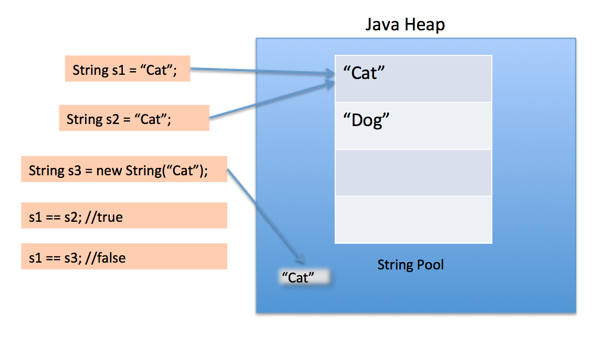

# String Pool

String Pool in java is a pool of Strings stored in Java Heap Memory. We know that String is a special class in java and we can create String objects using a new operator as well as providing values in double-quotes. String pool helps in saving a lot of space for Java Runtime although it takes more time to create the String.

Diagram that clearly explains how String Pool is maintained in java heap space and what happens when we use different ways to create Strings: 


When you create a new string like this:

`String s1 = “Cat”`  

JVM automatically checks if the same value exists in the string pool or not.
- if yes, it occupies the already existing value.
- If no, it creates a new string by itself and adds it to the string pool.

If you create a string using new operator:

`String s1 = new String(“Cat”)`  

you implicitly create a brand new object in the heap every time.

For add string to string poll java provide method - `intern()`, you can call it on string object:

`s1.intern()`  

Example: 

```
public final class App {

    public static void main(String args[]) {
        String cat1 = "Cat";
        String cat2 = "Cat";
        String cat3 = new String("Cat");

        System.out.println("cat1 == cat2 :" + (cat1 == cat2));
        System.out.println("cat1 == cat3 :" + (cat1 == cat3));
    }

}
```

Will print: 
```
cat1 == cat2 : true
cat1 == cat3 : false
```

## Links
https://www.journaldev.com/797/what-is-java-string-pool  
https://examples.javacodegeeks.com/core-java/lang/string/java-string-pool-example/  
https://www.edureka.co/blog/java-string-pool/  
