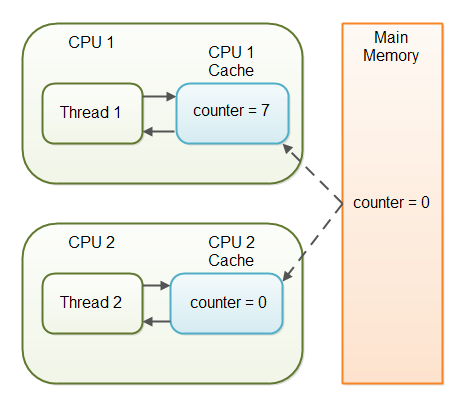

# Volatile keyword

The Java `volatile` keyword guarantees visibility of changes to variables across threads. Declaring a `volatile` variable means:

- The value of this variable will never be cached thread-locally: all reads and writes will go straight to "main memory";
- Access to the variable acts as though it is enclosed in a synchronized block, synchronized on itself.

The `volatile` keyword cannot be used with classes or methods only with variables. 

Imagine a situation in which two or more threads have access to a shared object which contains a counter variable declared like this:

```
public class SharedObject {
  public int counter = 0;
}
```

Imagine too, that only Thread 1 increments the counter variable, but both Thread 1 and Thread 2 may read the counter variable from time to time.

If the counter variable is not declared `volatile` there is no guarantee about when the value of the counter variable is written from the CPU cache back to main memory. This means, that the counter variable value in the CPU cache may not be the same as in main memory. This situation is illustrated here:



The problem with threads not seeing the latest value of a variable because it has not yet been written back to main memory by another thread, is called a "visibility" problem. The updates of one thread are not visible to other threads.

The Java `volatile` keyword is intended to address variable visibility problems. By declaring the counter variable `volatile` all writes to the counter variable will be written back to main memory immediately. Also, all reads of the counter variable will be read directly from main memory.

Here is how the `volatile` declaration of the counter variable looks:

```
public class SharedObject {
  public volatile int counter = 0;
}
```

Declaring a variable `volatile `thus guarantees the visibility for other threads of writes to that variable.

In the scenario given above, where one thread (T1) modifies the counter, and another thread (T2) reads the counter (but never modifies it), declaring the counter variable volatile is enough to guarantee visibility for T2 of writes to the counter variable.

## When to use it?
- You can use a volatile variable if you want to read and write long and double variable automatically.
- It can be used as an alternative way of achieving synchronization in Java.
- All reader threads will see the updated value of the volatile variable after completing the write operation. If you are not using the volatile keyword, different reader thread may see different values.
- It is used to inform the compiler that multiple threads will access a particular statement. It prevents the compiler from doing any reordering or any optimization.
- If you do not use volatile variable compiler can reorder the code, free to write in cache value of volatile variable instead of reading from the main memory.

## Links
https://www.javatpoint.com/volatile-keyword-in-java  
http://tutorials.jenkov.com/java-concurrency/volatile.html  
https://www.javamex.com/tutorials/synchronization_volatile.shtml  
https://www.geeksforgeeks.org/volatile-keyword-in-java/  
