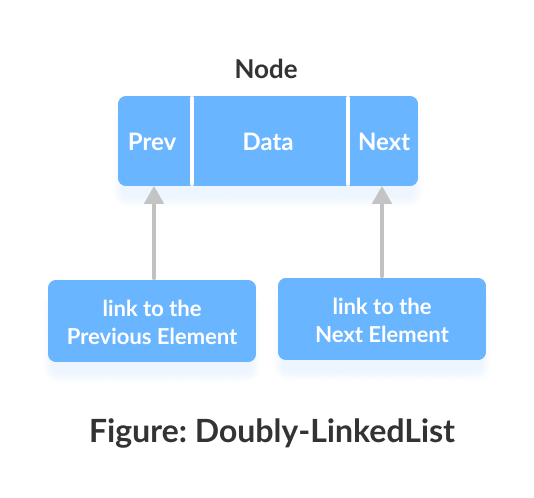
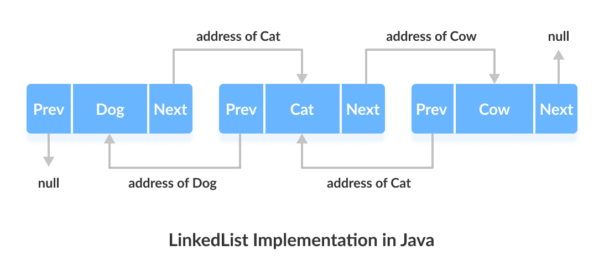

# LinkedList
Doubly-linked list implementation of the `List` and `Deque` interfaces. Implements all optional list operations, and permits all elements (including `null`).

All of the operations perform as could be expected for a doubly-linked list. Operations that index into the list will traverse the list from the beginning or the end, whichever is closer to the specified index.

Since a `LinkedList` acts as a dynamic array and we do not have to specify the size while creating it, the size of the list automatically increases when we dynamically add and remove items. And also, the elements are not stored in a continuous fashion. Therefore, there is no need to increase the size. Internally, the `LinkedList` is implemented using the doubly linked list data structure. The main difference between a normal and a doubly linked list is that a doubly contains an extra pointer, typically called the previous pointer, together with the next pointer and data which are there in the singly linked list.

## Internal implementation
`LinkedList` class provides a doubly linked list implementation.



Each element in a linked list is known as a **node**. It consists of 3 fields:
- **Prev** - Stores an address of the previous element in the list. It is `null` for the first element;
- **Next** - Stores an address of the next element in the list. It is `null` for the last element;
- **Data** - Stores the actual data.

Elements in linked lists are not stored in sequence. Instead, they are scattered and connected through links (Prev and Next).


Here we have 3 elements in a linked list.
- `Dog` - it is the first element that holds `null` as previous address and address of `Cat` as next address;
- `Cat` - it is the second element that holds an address of `Dog` as previous address and address of `Cow` as next address;
- `Cow` - it is the last element that holds the address of `Cat` as the previous address and `null` as the next element.

## Synchronization
`LinkedList` is not synchronized. If multiple threads access a linked list concurrently, and at least one of the threads modifies the list structurally, it *must* be synchronized externally. This is typically accomplished by synchronizing on some object that naturally encapsulates the list. If no such object exists, the list should be "wrapped" using the `Collections.synchronizedList` method. This is best done at creation time, to prevent accidental unsynchronized access to the list:

`List list = Collections.synchronizedList(new LinkedList(...));`

The iterators returned by this class's iterator method are fail-fast: if the list is modified at any time after the iterator is created, in any way except through the iterator's own `remove` method, the `Iterator` throws a `ConcurrentModificationException`. Thus, in the face of concurrent modification, the iterator fails quickly and cleanly, rather than risking arbitrary, non-deterministic behavior at an undetermined time in the future.

Note that the fail-fast behavior of an iterator cannot be guaranteed as it is, generally speaking, impossible to make any hard guarantees in the presence of unsynchronized concurrent modification. Fail-fast iterators throw `ConcurrentModificationException` on a best-effort basis. Therefore, it would be wrong to write a program that depended on this exception for its correctness: *the fail-fast behavior of iterators should be used only to detect bugs*.

## Example of usage
```
import java.util.*; 
  
public class Test { 
  
    public static void main(String args[]) 
    { 
        // Creating object of the 
        // class linked list 
        LinkedList<String> ll = new LinkedList<String>(); 
  
        // Adding elements to the linked list 
        ll.add("A"); 
        ll.add("B"); 
        ll.addLast("C"); 
        ll.addFirst("D"); 
        ll.add(2, "E"); 
  
        System.out.println(ll); 
  
        ll.remove("B"); 
        ll.remove(3); 
        ll.removeFirst(); 
        ll.removeLast(); 
  
        System.out.println(ll); 
    } 
} 
```

Output: 
```
[D, A, E, B, C]
[A]
```

## Conclusion
`LinkedList` are:
- Inherits the `AbstractList` class;
- Implements `List` and `Deque` interfaces;
- Can contain duplicate elements;
- Maintains insertion order;
- Not synchronized;
- Perforam `add()` and `remove()` operation for constant time - `O(1)`.

## Links
https://docs.oracle.com/javase/7/docs/api/java/util/LinkedList.html  
https://www.javatpoint.com/java-linkedlist  
https://beginnersbook.com/2013/12/linkedlist-in-java-with-example/  
https://www.geeksforgeeks.org/linked-list-in-java/  
https://www.programiz.com/java-programming/linkedlist
