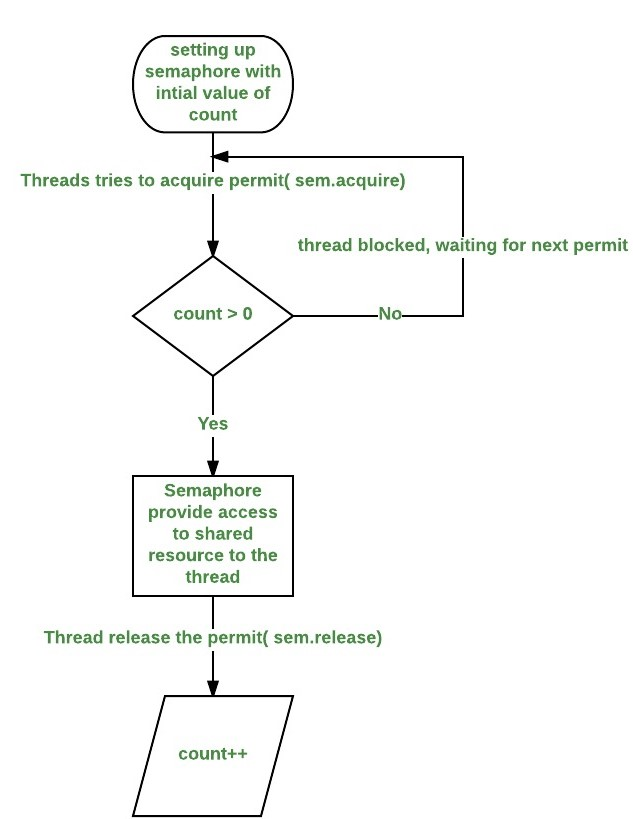

# Semaphore
`Semaphore` (`java.util.concurrent.Semaphore`) used for limit the number of threads accessing a specific resource. Conceptually, a semaphore maintains a set of permits. Each `acquire()` blocks if necessary until a permit is available, and then takes it. Each `release()` adds a permit, potentially releasing a blocking acquirer. However, no actual permit objects are used; the `Semaphore` just keeps a count of the number available and acts accordingly.

In general, to use a semaphore, the thread that wants access to the shared resource tries to acquire a permit.
- If the semaphore’s count is greater than zero, then the thread acquires a permit, which causes the semaphore’s count to be decremented.
- Otherwise, the thread will be blocked until a permit can be acquired.
- When the thread no longer needs an access to the shared resource, it releases the permit, which causes the semaphore’s count to be incremented.
- If there is another thread waiting for a permit, then that thread will acquire a permit at that time.



There are two constructors in `Semaphore` class: 
- `Semaphore(int num)`
- `Semaphore(int num, boolean fair)`

`num` specifies the initial permit count. Thus, it specifies the number of threads that can access a shared resource at any one time. If it is one, then only one thread can access the resource at any one time.

`fair` when set false, semaphore makes no guarantees about the order in which threads acquire permits. In particular, *barging* is permitted, that is, a thread invoking `acquire()` can be allocated a permit ahead of a thread that has been waiting - logically the new thread places itself at the head of the queue of waiting threads. When `fair` is set true, the semaphore guarantees that threads invoking any of the `acquire` methods are selected to obtain permits in the order in which their invocation of those methods was processed (first-in-first-out; FIFO). Note that FIFO ordering necessarily applies to specific internal points of execution within these methods. So, it is possible for one thread to invoke acquire before another, but reach the ordering point after the other, and similarly upon return from the method. Also note that the untimed `tryAcquire` methods do not honor the fairness setting, but will take any permits that are available.

Example: 
```
public class SemaphoreExample {

    private static Semaphore semaphore = new Semaphore(3);

    static class SemaphoreThread extends Thread {

        private final String name;

        SemaphoreThread(String name) {
            this.name = name;
        }

        public void run() {

            try {
                System.out.println(name + " acquiring lock");
                System.out.println(name + " available Semaphore permits: " + semaphore.availablePermits());

                semaphore.acquire();
                System.out.println(name + " got the permit");

                for (int i = 1; i <= 5; i++) {
                    System.out.println(name + " : is performing operation");
                    Thread.sleep(1000);
                }

            } catch (InterruptedException e) {
                e.printStackTrace();
            } finally {
                System.out.println(name + " : releasing lock");
                semaphore.release();
                System.out.println(name + " : available Semaphore permits after finish work = " + semaphore.availablePermits());
            }
        }
    }

    public static void main(String[] args) {

        System.out.println("Total available Semaphore permits : " + semaphore.availablePermits());

        SemaphoreThread st1 = new SemaphoreThread("First");
        st1.start();

        SemaphoreThread st2 = new SemaphoreThread("Second");
        st2.start();

        SemaphoreThread st3 = new SemaphoreThread("Third");
        st3.start();

        SemaphoreThread st4 = new SemaphoreThread("Fourth");
        st4.start();

        SemaphoreThread st5 = new SemaphoreThread("Fifth");
        st5.start();

        SemaphoreThread st6 = new SemaphoreThread("Sixth");
        st6.start();
    }
}
```

Output (may be different):
```
Total available Semaphore permits : 3
First acquiring lock
First available Semaphore permits: 3
First got the permit
First : is performing operation
Second acquiring lock
Second available Semaphore permits: 2
Second got the permit
Second : is performing operation
Third acquiring lock
Fourth acquiring lock
Fourth available Semaphore permits: 1
Fourth got the permit
Fourth : is performing operation
Third available Semaphore permits: 1
Fifth acquiring lock
Fifth available Semaphore permits: 0
Sixth acquiring lock
Sixth available Semaphore permits: 0
First : is performing operation
Second : is performing operation
Fourth : is performing operation
First : is performing operation
Second : is performing operation
Fourth : is performing operation
First : is performing operation
Second : is performing operation
Fourth : is performing operation
First : is performing operation
Second : is performing operation
Fourth : is performing operation
First : releasing lock
First : available Semaphore permits after finish work = 1
Third got the permit
Third : is performing operation
Second : releasing lock
Fifth got the permit
Fifth : is performing operation
Second : available Semaphore permits after finish work = 0
Fourth : releasing lock
Fourth : available Semaphore permits after finish work = 1
Sixth got the permit
Sixth : is performing operation
Third : is performing operation
Fifth : is performing operation
Sixth : is performing operation
Third : is performing operation
Fifth : is performing operation
Sixth : is performing operation
Third : is performing operation
Fifth : is performing operation
Sixth : is performing operation
Third : is performing operation
Fifth : is performing operation
Sixth : is performing operation
Fifth : releasing lock
Fifth : available Semaphore permits after finish work = 1
Third : releasing lock
Third : available Semaphore permits after finish work = 2
Sixth : releasing lock
Sixth : available Semaphore permits after finish work = 3
```

## Links
http://tutorials.jenkov.com/java-concurrency/semaphores.html  
https://www.geeksforgeeks.org/semaphore-in-java/  
https://www.baeldung.com/java-semaphore  
https://docs.oracle.com/javase/7/docs/api/java/util/concurrent/Semaphore.html  
