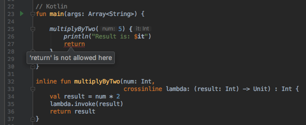

# Crossinline keyword

The `crossinline` marker is used to mark lambdas that mustn’t allow non-local returns, especially when such lambda is passed to another execution context such as a higher order function that is not inlined, a local object or a nested function. In other words, helps us enforce the control flow (return statement) of lambda functions passed as arguments in inline functions. Avoiding non-local control flow.

## Links
https://kotlinlang.org/docs/reference/inline-functions.html    
https://medium.com/@tferreirap/kotlin-quick-look-at-inline-noinline-and-crossinline-e62e8833db1f  
https://android.jlelse.eu/inline-noinline-crossinline-what-do-they-mean-b13f48e113c2      
