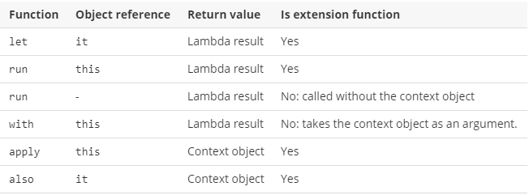

# Scope functions
The Kotlin standard library contains several functions whose sole purpose is to execute a block of code within the context of an object. When you call such a function on an object with a lambda expression provided, it forms a temporary scope. In this scope, you can access the object without its name. Such functions are called **scope functions**. There are five of them: `let`, `run`, `with`, `apply`, and `also`.

Here's a typical usage of a scope function:

```
Person("Alice", 20, "Amsterdam").let {
    println(it)
    it.moveTo("London")
    it.incrementAge()
    println(it)
}
```

The scope functions do not introduce any new technical capabilities, but they can make your code more concise and readable.

Due to the similar nature of scope functions, choosing the right one for your case can be a bit tricky. The choice mainly depends on your intent and the consistency of use in your project.

## Distinctions
Because the scope functions are all quite similar in nature, it's important to understand the differences between them. There are two main differences between each scope function:

- The way to refer to the context object
- The return value.

### Context object: this or it
Inside the lambda of a scope function, the context object is available by a short reference instead of its actual name. Each scope function uses one of two ways to access the context object: as a lambda receiver (`this`) or as a lambda argument (`it`)

```
fun main() {
    val str = "Hello"
    // this
    str.run {
        println("The receiver string length: $length")
        //println("The receiver string length: ${this.length}") // does the same
    }

    // it
    str.let {
        println("The receiver string's length is ${it.length}")
    }
}
```

**this**. `run`, `with`, and `apply` refer to the context object as a lambda receiver - by keyword `this`. Hence, in their lambdas, the object is available as it would be in ordinary class functions. In most cases, you can omit this when accessing the members of the receiver object, making the code shorter. On the other hand, if `this` is omitted, it can be hard to distinguish between the receiver members and external objects or functions. So, having the context object as a receiver (`this`) is recommended for lambdas that mainly operate on the object members: call its functions or assign properties.

**it**.In turn, `let` and `also` have the context object as a lambda argument. If the argument name is not specified, the object is accessed by the implicit default name it. `it` is shorter than `this` and expressions with `it` are usually easier for reading. However, when calling the object functions or properties you don't have the object available implicitly like this. Hence, having the context object as `it` is better when the object is mostly used as an argument in function calls. `it` is also better if you use multiple variables in the code block.


### Return value
The scope functions differ by the result they return:
- `apply` and `also` return the context object.
- `let`, `run`, and `with` return the lambda result.

The return value of `apply` and `also` is the context object itself. Hence, they can be included into call chains as side steps: you can continue chaining function calls on the same object after them.

```
val numberList = mutableListOf<Double>()
numberList.also { println("Populating the list") }
    .apply {
        add(2.71)
        add(3.14)
        add(1.0)
    }
    .also { println("Sorting the list") }
    .sort()
```

They also can be used in return statements of functions returning the context object.

```
fun getRandomInt(): Int {
    return Random.nextInt(100).also {
        writeToLog("getRandomInt() generated value $it")
    }
}

val i = getRandomInt()
```

`let`, `run`, and `with` return the lambda result. So, you can use them when assigning the result to a variable, chaining operations on the result, and so on.

```
val numbers = mutableListOf("one", "two", "three")
val countEndsWithE = numbers.run { 
    add("four")
    add("five")
    count { it.endsWith("e") }
}
println("There are $countEndsWithE elements that end with e.")
```

Additionally, you can ignore the return value and use a scope function to create a temporary scope for variables.

```
val numbers = mutableListOf("one", "two", "three")
with(numbers) {
    val firstItem = first()
    val lastItem = last()        
    println("First item: $firstItem, last item: $lastItem")
}
```

## Functions

### let
**The context object** is available as an argument (`it`). **The return value** is the lambda result.

`let` can be used to invoke one or more functions on results of call chains. For example, the following code prints the results of two operations on a collection:

```
val numbers = mutableListOf("one", "two", "three", "four", "five")
val resultList = numbers.map { it.length }.filter { it > 3 }
println(resultList)    
```

With `let`, you can rewrite it:
```
val numbers = mutableListOf("one", "two", "three", "four", "five")
numbers.map { it.length }.filter { it > 3 }.let { 
    println(it)
    // and more function calls if needed
} 
```

`let` is often used for executing a code block only with non-null values. To perform actions on a non-null object, use the safe call operator ?. on it and call let with the actions in its lambda.

```
val str: String? = "Hello"   
//processNonNullString(str)       // compilation error: str can be null
val length = str?.let { 
    println("let() called on $it")        
    processNonNullString(it)      // OK: 'it' is not null inside '?.let { }'
    it.length
}
```

Another case for using `let` is introducing local variables with a limited scope for improving code readability. To define a new variable for the context object, provide its name as the lambda argument so that it can be used instead of the default `it`.

```
val numbers = listOf("one", "two", "three", "four")
val modifiedFirstItem = numbers.first().let { firstItem ->
    println("The first item of the list is '$firstItem'")
    if (firstItem.length >= 5) firstItem else "!" + firstItem + "!"
}.toUpperCase()
println("First item after modifications: '$modifiedFirstItem'")
```

### with
A non-extension function: **the context object** is passed as an argument, but inside the lambda, it's available as a receiver (`this`). **The return value** is the lambda result.

We recommend `with` for calling functions on the context object without providing the lambda result. In the code, `with` can be read as *“with this object, do the following.”*

```
val numbers = mutableListOf("one", "two", "three")
with(numbers) {
    println("'with' is called with argument $this")
    println("It contains $size elements")
}
```

Another use case for `with` is introducing a helper object whose properties or functions will be used for calculating a value.

```
val numbers = mutableListOf("one", "two", "three")
val firstAndLast = with(numbers) {
    "The first element is ${first()}," +
    " the last element is ${last()}"
}
println(firstAndLast)
```

### run
**The context object** is available as a receiver (this). **The return value** is the lambda result.

`run` does the same as `with` but invokes as `let` - as an extension function of the context object.

`run` is useful when your lambda contains both the object initialization and the computation of the return value.

```
val service = MultiportService("https://example.kotlinlang.org", 80)

val result = service.run {
    port = 8080
    query(prepareRequest() + " to port $port")
}

// the same code written with let() function:
val letResult = service.let {
    it.port = 8080
    it.query(it.prepareRequest() + " to port ${it.port}")
}
```

Besides calling `run` on a receiver object, you can use it as a non-extension function. Non-extension `run` lets you execute a block of several statements where an expression is required.

```
val hexNumberRegex = run {
    val digits = "0-9"
    val hexDigits = "A-Fa-f"
    val sign = "+-"

    Regex("[$sign]?[$digits$hexDigits]+")
}

for (match in hexNumberRegex.findAll("+1234 -FFFF not-a-number")) {
    println(match.value)
}
```

### apply
**The context object** is available as a receiver (`this`). **The return value** is the object itself.

Use `apply` for code blocks that don't return a value and mainly operate on the members of the receiver object. The common case for `apply` is the object configuration. Such calls can be read as *“apply the following assignments to the object.”*

```
val adam = Person("Adam").apply {
    age = 32
    city = "London"        
}
println(adam)
```

Having the receiver as the return value, you can easily include `apply` into call chains for more complex processing.

### also
**The context object** is available as an argument (it). **The return value** is the object itself.

`also` is good for performing some actions that take the context object as an argument. Use `also` for actions that need a reference rather to the object than to its properties and functions, or when you don't want to shadow `this` reference from an outer scope.

When you see `also` in the code, you can read it as *“and also do the following with the object.”*
```
val numbers = mutableListOf("one", "two", "three")
numbers
    .also { println("The list elements before adding new one: $it") }
    .add("four")
```

## Function selection


Here is a short guide for choosing scope functions depending on the intended purpose:

- Executing a lambda on non-null objects: `let`
- Introducing an expression as a variable in local scope: `let`
- Object configuration: `apply`
- Object configuration and computing the result: `run`
- Running statements where an expression is required: non-extension `run`
- Additional effects: `also`
- Grouping function calls on an object: `with`

## Links
https://kotlinlang.org/docs/reference/scope-functions.html
