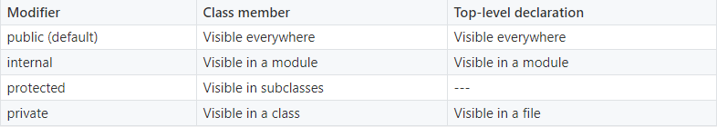

# Visibility modifiers

Kotlin allows you to enforce symbol visibility via *visibility modifiers*, which can be placed on symbol declarations. 

There are four visibility modifiers in Kotlin: **private**, **protected**, **internal** and **public**.

- **public**: declarations are visible everywhere.
- **private**: means visible inside this class only (including all its members)
- **protected**: means visible inside this class (including all its members) + visible in subclasses too
- **internal**: modifier are visible everywhere in the same module.

If you don't supply a visibility modifier, you get the default visibility level, which is **public**.

## Java vs Kotlin
- In Java, the default modifier is **package private**, in Kotlin is **public**.
- Java’s **package private** doesn’t have an equivalent in Kotlin, the closest is **internal**.
- An Outer class does not see **private** members of its inner class in Kotlin.
- If you override a **protected** member and do not specify the visibility explicitly, the overriding member will also have **protected** visibility. In Java the visibility is according to the modifier and the default is still **public**.

## Links
https://kotlinlang.org/docs/tutorials/kotlin-for-py/visibility-modifiers.html    
https://kotlinlang.org/docs/reference/visibility-modifiers.html    
https://medium.com/mindorks/kotlin-for-android-developers-visibility-modifiers-8d8a3b84d298  
https://medium.com/@HugoMatilla/kotlin-basics-visibility-modifiers-public-internal-protected-and-private-c3bf972aee11  
