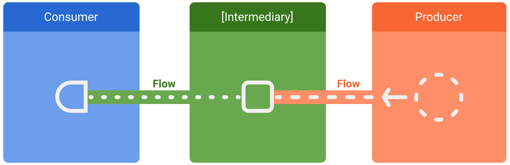

# Flow
In coroutines, a *flow* is a type that can emit multiple values sequentially, as opposed to *suspend functions* that return only a single value. For example, you can use a flow to receive live updates from a database.

Flows are built on top of coroutines and can provide multiple values. A flow is conceptually a *stream of data* that can be computed asynchronously. To represent the stream of values that are being asynchronously computed, we can use a `Flow<Int>` type:
```
fun simple(): Flow<Int> = flow { // flow builder
    for (i in 1..3) {
        delay(100) // pretend we are doing something useful here
        emit(i) // emit next value
    }
}

fun main() = runBlocking<Unit> {
    // Launch a concurrent coroutine to check if the main thread is blocked
    launch {
        for (k in 1..3) {
            println("I'm not blocked $k")
            delay(100)
        }
    }
    // Collect the flow
    simple().collect { value -> println(value) } 
}
```

This code waits 100ms before printing each number without blocking the main thread. This is verified by printing "I'm not blocked" every 100ms from a separate coroutine that is running in the main thread:

```
I'm not blocked 1
1
I'm not blocked 2
2
I'm not blocked 3
3
```
A flow is very similar to an `Iterator` that produces a sequence of values, but it uses suspend functions to produce and consume values asynchronously. This means, for example, that the flow can safely make a network request to produce the next value without blocking the main thread.

There are three entities involved in streams of data:
- A **producer** produces data that is added to the stream. Thanks to coroutines, flows can also produce data asynchronously;
- **(Optional) Intermediaries** can modify each value emitted into the stream or the stream itself;
- A **consumer** consumes the values from the stream. 



In Android, a *data source* or *repository* is typically a producer of UI data that has the `View` as the consumer that ultimately displays the data. Other times, the `View` layer is a producer of user input events and other layers of the hierarchy consume them. Layers in between the producer and consumer usually act as intermediaries that modify the stream of data to adjust it to the requirements of the following layer.

## Flow builders
There are the following basic ways to create a flow:
- [`flowOf(…)`](https://kotlin.github.io/kotlinx.coroutines/kotlinx-coroutines-core/kotlinx.coroutines.flow/flow-of.html) functions to create a flow from a fixed set of values;
- [`asFlow()`](https://kotlin.github.io/kotlinx.coroutines/kotlinx-coroutines-core/kotlinx.coroutines.flow/kotlin.-function0/as-flow.html) extension functions on various types to convert them into flows;
- [`flow { … } `](https://kotlin.github.io/kotlinx.coroutines/kotlinx-coroutines-core/kotlinx.coroutines.flow/-flow/#) builder function to construct arbitrary flows from sequential calls to `emit` function;
- [`channelFlow { … }`](https://kotlin.github.io/kotlinx.coroutines/kotlinx-coroutines-core/kotlinx.coroutines.flow/channel-flow.html) builder function to construct arbitrary flows from potentially concurrent calls to the `send` function.
- [`MutableStateFlow`](https://kotlin.github.io/kotlinx.coroutines/kotlinx-coroutines-core/kotlinx.coroutines.flow/-mutable-state-flow/index.html) and [`MutableSharedFlow()`](https://kotlin.github.io/kotlinx.coroutines/kotlinx-coroutines-core/kotlinx.coroutines.flow/-mutable-shared-flow/index.html) define the corresponding constructor functions to create a *hot* flow that can be directly updated.

## Flows are cold
Flows are *cold streams* similar to sequences — the code inside a flow builder does not run until the flow is collected. This becomes clear in the following example:
```
fun simple(): Flow<Int> = flow { 
    println("Flow started")
    for (i in 1..3) {
        delay(100)
        emit(i)
    }
}

fun main() = runBlocking<Unit> {
    println("Calling simple function...")
    val flow = simple()
    println("Calling collect...")
    flow.collect { value -> println(value) } 
    println("Calling collect again...")
    flow.collect { value -> println(value) } 
}
```

Which prints:
```
Calling simple function...
Calling collect...
Flow started
1
2
3
Calling collect again...
Flow started
1
2
3
```

This is a key reason the `simple` function (which returns a flow) is not marked with `suspend` modifier. By itself, `simple()` call returns quickly and does not wait for anything. The flow starts every time it is collected, that is why we see "Flow started" when we call `collect` again.

*Intermediate operators* on the flow such as `map`, `filter`, `take`, `zip`, etc are functions that are applied to the *upstream* flow or flows and return a *downstream* flow where further operators can be applied to. Intermediate operations do not execute any code in the flow and are not suspending functions themselves. They only set up a chain of operations for future execution and quickly return. This is known as a *cold flow* property.

## Collecting from a flow
Use a *terminal operator* to trigger the flow to start listening for values. Terminal operators on the flow are either suspending functions such as `collect`, `single`, `reduce`, `toList`, etc. or `launchIn` operator that starts collection of the flow in the given scope. They are applied to the upstream flow and trigger execution of all operations. Execution of the flow is also called *collecting the flow* and is always performed in a suspending manner without actual blocking. Terminal operators complete normally or exceptionally depending on successful or failed execution of all the flow operations in the upstream. The most basic terminal operator is collect, for example:

```
try {
    flow.collect { value ->
        println("Received $value")
    }
} catch (e: Exception) {
    println("The flow has thrown an exception: $e")
}
```
By default, flows are *sequential* and all flow operations are executed sequentially in the same coroutine, with an exception for a few operations specifically designed to introduce concurrency into flow execution such as [buffer](https://kotlin.github.io/kotlinx.coroutines/kotlinx-coroutines-core/kotlinx.coroutines.flow/buffer.html) and [flatMapMerge](https://kotlin.github.io/kotlinx.coroutines/kotlinx-coroutines-core/kotlinx.coroutines.flow/flat-map-merge.html).

# Links
https://kotlinlang.org/docs/reference/coroutines/flow.html  
https://developer.android.com/kotlin/flow  
https://kotlin.github.io/kotlinx.coroutines/kotlinx-coroutines-core/kotlinx.coroutines.flow/-flow/

# Futher reading
[Testing Kotlin flows on Android](https://developer.android.com/kotlin/flow/test)  
[StateFlow and SharedFlow](https://developer.android.com/kotlin/flow/stateflow-and-sharedflow)  
[Additional resources for Kotlin coroutines and flow](https://developer.android.com/kotlin/coroutines/additional-resources)  
