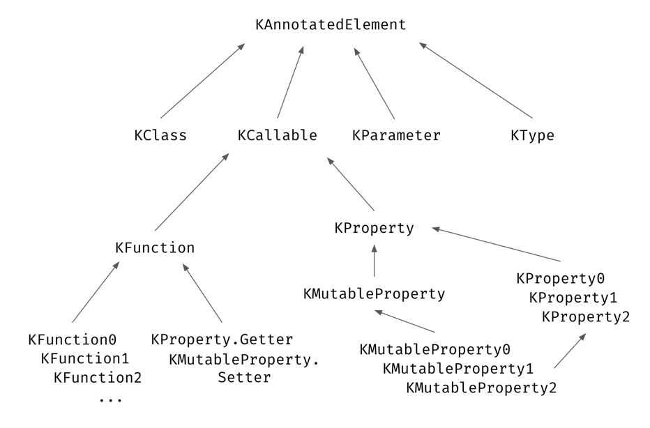

# Reflection
**Reflection** is a set of language and library features that allows you to introspect the structure of your program at runtime. Functions and properties are first-class citizens in Kotlin, and the ability to introspect them (for example, learning the name or the type of a property or function at runtime) is essential when using a functional or reactive style.<sup>[1](https://kotlinlang.org/docs/reflection.html#:~:text=Reflection%20is%20a,or%20reactive%20style.)</sup>

Reflection is useful in many situations, such as:<sup>[2](https://www.geeksforgeeks.org/kotlin/kotlin-reflection/#:~:text=Reflection%20is%20useful,members%20(with%20care))</sup>
- Creating frameworks;
- Building libraries;
- Serialization and deserialization;
- Writing advanced test cases;
- Accessing private members.

Features of Kotlin reflection:<sup>[3](https://www.geeksforgeeks.org/kotlin/kotlin-reflection/#:~:text=Features%20of%20Kotlin,to%20Java%20reflection.)</sup>
- **Access to Properties and Functions**. Retrieve and manipulate properties and methods of classes during runtime;
- **Support for Nullable Types**. Reflect on nullability and type information;
- **Integration with Java Reflection**. Kotlin reflection works smoothly with Java’s reflection system;
- **Introspection of JVM Code**. Kotlin can reflect on code written in Java or other JVM languages;
- **Simplified Syntax**. Kotlin offers a more readable and functional syntax compared to Java reflection.

## [Hierarchy of classes](https://kt.academy/article/ak-reflection#hierarchy-of-classes)
Here is general type hierarchy of element references:


Notice that all the types in this hierarchy start with the `K` prefix. This indicates that this type is part of Kotlin Reflection and differentiates these classes from Java Reflection. The type `Class` is part of Java Reflection, so Kotlin called its equivalent `KClass`.

At the top of this hierarchy, you can find `KAnnotatedElement`. *Element* is a term that includes classes, functions, and properties, so it includes everything we can reference. All elements can be annotated, which is why this interface includes the `annotations` property, which we can use to get element annotations.

```
interface KAnnotatedElement {
    val annotations: List<Annotation>
}
```

The next confusing thing you might have noticed is that there is no type to represent interfaces. This is because interfaces in reflection API nomenclature are also considered classes, so their references are of type `KClass`. This might be confusing, but it is really convenient.

## Class references
The most basic reflection feature is getting the runtime reference to a Kotlin class. To obtain the reference to a statically known Kotlin class, you can use the **class literal** syntax:<sup>[4](https://kotlinlang.org/docs/reflection.html#class-references:~:text=The%20most%20basic%20reflection%20feature%20is%20getting%20the%20runtime%20reference%20to%20a%20Kotlin%20class.%20To%20obtain%20the%20reference%20to%20a%20statically%20known%20Kotlin%20class%2C%20you%20can%20use%20the%20class%20literal%20syntax%3A)</sup>
```
val c = MyClass::class
```

This returns a `KClass<MyClass>` object, which is Kotlin’s reflection representation of a class.

You may wish to call functions on an object/class without knowing the functions available at compile time. Kotlin reflection allows us to introspect classes, extract the methods available on a class and then call these methods.<sup>[5](https://www.thekotlindev.com/2022/reflection/#:~:text=You%20may%20wish%20to%20call%20functions%20on%20an%20object/class%20without%20knowing%20the%20functions%20available%20at%20compile%20time.%0AKotlin%20reflection%20allows%20us%20to%20introspect%20classes%2C%20extract%20the%20methods%20available%20on%20a%20class%20and%20then%20call%20these%20methods.)</sup>:
```
class SomeClass {
    fun withPrefix() = "Hello"
    private fun withSuffix() = "Goodbye"
}

val classReference = SomeClass::class

val functions = classReference.declaredFunctions
functions.forEach {
    print("${it.name} result: ")
    it.isAccessible = true
    println(it.call(classReference.createInstance()))
}

// result
// withPrefix result: Hello
// withSuffix result: Goodbye
```

As you can see, we are able to run all the functions on the class `SomeClass`, including private functions, all from a class reference. To call a private function, you need to set the `isAccessible` flag to `true`.<sup>[6](https://www.thekotlindev.com/2022/reflection/#:~:text=As%20you%20can%20see%2C%20we%20are%20able%20to%20run%20all%20the%20functions%20on%20the%20class%20SomeClass%2C%20including%20private%20functions%2C%20all%20from%20a%20class%20reference.%20To%20call%20a%20private%20function%2C%20you%20need%20to%20set%20the%20isAccessible%20flag%20to%20true.)</sup>

## Callable references
References to functions, properties, and constructors can also be called or used as instances of [function types](https://kotlinlang.org/docs/lambdas.html#function-types).

The common supertype for all callable references is `KCallable<out R>`, where `R` is the return value type. It is the property type for properties, and the constructed type for constructors.<sup>[7](https://kotlinlang.org/docs/reflection.html#callable-references:~:text=References%20to%20functions,type%20for%20constructors.)</sup>

### [Function references](https://www.geeksforgeeks.org/kotlin/kotlin-reflection/#:~:text=reference%3A%20class%20ReflectionDemo-,Function%20references,-We%20can%20obtain)
We can obtain a **functional reference** to every named function that is defined in Kotlin. This can be done by **preceding** the function name with the `:: operator`. These functional references can then be used as parameters to other functions:
```
fun multiplyByThree(x: Int) = x * 3

fun main() {
    val numbers = listOf(1, 2, 3)
    // Function reference obtained using :: operator
    val result = numbers.map(::multiplyByThree)
    println(result)
}
```

Output:
```
[3, 6, 9]
```

### [Property References](https://www.geeksforgeeks.org/kotlin/kotlin-reflection/#:~:text=Kotlin%20Reflection%0A8-,Property%20References,-We%20can%20obtain)
We can obtain **property reference** in a similar fashion as that of function, using the `::` operator. If the property belongs to a class then the class-name should also be specified with the `::` operator. These property references allow us to treat a property as an object that is, we can obtain their values using get function or modify it using set function:
```
var x = 10

fun main() {
    val propRef = ::x
    println(propRef.get())
    propRef.set(20)
    println(x)
}
```

Output:
```
10
20
```

For class properties, use the class name or instance:
```
class Circle(var radius: Double)

fun main() {
    val circle = Circle(5.899)
    val radiusRef = Circle::radius
    println(radiusRef.get(circle))
}
```

Output:
```
5.899 
```

### [Constructor References](https://www.geeksforgeeks.org/kotlin/kotlin-reflection/#:~:text=Constructor%20References)
The references to constructors of a class can be obtained in a similar manner as the references for methods and properties. These references can be used as references to a function which returns an object of that type. However, these uses are rare.
```
class Person(val name: String)

fun main() {
    // Constructor Reference
    val constructorRef = ::Person
    val person = constructorRef("Alice")
    println(person.name)
}
```

## [Interoperability with Java reflection](https://kotlinlang.org/docs/reflection.html#interoperability-with-java-reflection)
On the JVM platform, the standard library contains extensions for reflection classes that provide a mapping to and from Java reflection objects (see package `kotlin.reflect.jvm`). For example, to find a backing field or a Java method that serves as a getter for a Kotlin property, you can write something like this:
```
import kotlin.reflect.jvm.*

class A(val p: Int)

fun main() {
    println(A::p.javaGetter) // prints "public final int A.getP()"
    println(A::p.javaField)  // prints "private final int A.p"
}
```

To get the Kotlin class that corresponds to a Java class, use the `.kotlin` extension property:
```
fun getKClass(o: Any): KClass<Any> = o.javaClass.kotlin
```

## Use cases

### [Working with Annotations via Reflection](https://medium.com/@ignatiah.x/kotlin-reflection-a-comprehensive-guide-fd6f2e335672#:~:text=7,Moshi%29%2E)</sup>

```
@Target(AnnotationTarget.CLASS)
@Retention(AnnotationRetention.RUNTIME)
annotation class Info(val description: String)

@Info("This is a data class")
data class Customer(val id: Int, val name: String)

fun main() {
    val annotation = Customer::class.annotations.find { it is Info } as? Info
    println("Annotation Description: ${annotation?.description}") // Output: This is a data class
}
```

Used in serialization frameworks (**Kotlinx.Serialization**, **Moshi**).

### [Dependency Injection with Koin](https://medium.com/@ignatiah.x/kotlin-reflection-a-comprehensive-guide-fd6f2e335672#:~:text=8%2E2,get%28%29%29%20%7D%7D)</sup>

Koin uses reflection to **automatically instantiate dependencies**:

```
val appModule = module {
    single { NetworkClient() }
    single { Repository(get()) }
}
```

Reflection resolves **constructor dependencies dynamically**.

### [Automated Testing & Logging](https://medium.com/@ignatiah.x/kotlin-reflection-a-comprehensive-guide-fd6f2e335672#:~:text=Automated,monitoring%2E)</sup>
Reflection is used for logging and test frameworks:

```
fun logMethods(instance: Any) {
    instance::class.memberFunctions.forEach { println("Function: ${it.name}") }
}

class Example { fun demo() {} }

fun main() { logMethods(Example()) }
```

Useful for **debugging and performance monitoring**.

## Drawbacks of Reflection
Reflection is powerful, but should not be used indiscriminately. If it is possible to perform an operation without using reflection, then it is preferable to avoid using it. The following concerns should be kept in mind when accessing code via reflection:<sup>[8](https://dev.java/learn/reflection/intro/#:~:text=Drawbacks%20of%20Reflection,portability.%20Reflective%20code)</sup>
- **Performance Overhead**. Because reflection involves types that are dynamically resolved, certain Java virtual machine optimizations can not be performed. Consequently, reflective operations have slower performance than their non-reflective counterparts, and should be avoided in sections of code which are called frequently in performance-sensitive applications;
- **Security Restrictions**. Reflection requires a runtime permission which may not be present when running under a security manager. This is in an important consideration for code which has to run in a restricted security context. You also need to be aware that reflection has lost its ability to introspect the classes of the standard Java API;
- **Exposure of Internals**. Since reflection allows code to perform operations that would be illegal in non-reflective code, such as accessing private fields and methods, the use of reflection can result in unexpected side effects, which may render code dysfunctional and may destroy portability. Reflective code breaks abstractions and therefore may change behavior with upgrades of the platform.

Android-specific concerns:
- Increases application size and dependency footprint;
- Slower startup if heavily used;
- Harder debugging;
- Obfuscation issues with R8 / ProGuard;
- Runtime crashes caused by renamed, removed, or obfuscated members.

# Links
[Reflection](https://kotlinlang.org/docs/reflection.html)

[Kotlin Reflection](https://www.geeksforgeeks.org/kotlin/kotlin-reflection/)

[Kotlin Reflection: Method and property references](https://kt.academy/article/ak-reflection)

[Introducing Kotlin reflection](https://www.thekotlindev.com/2022/reflection/)

[Introducing the Reflection API](https://dev.java/learn/reflection/intro/)

[Kotlin Reflection: A Comprehensive Guide](https://medium.com/@ignatiah.x/kotlin-reflection-a-comprehensive-guide-fd6f2e335672)

# Further reading
[Kotlin Reflection: A Comprehensive Guide](https://medium.com/@ramadan123sayed/kotlin-reflection-a-comprehensive-guide-f00417f2f521)

[A Beginner’s Guide to Understanding Kotlin Reflection](https://www.dhiwise.com/post/a-beginners-guide-to-understanding-kotlin-reflection)

[Kotlin Reflection: Class references](https://kt.academy/article/ak-reflection-class)

[Kotlin Reflection: Type references](https://kt.academy/article/ak-reflection-type)
