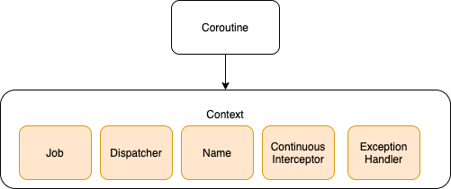
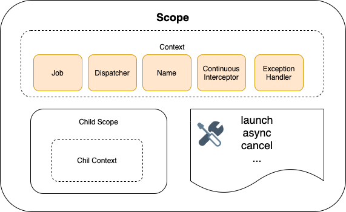

# Coroutine Scope vs Coroutine Context

## CoroutineContext

Coroutines always execute in some context represented by a value of the `CoroutineContext` type, defined in the Kotlin standard library.

```
/**
 * Persistent context for the coroutine. 
 * It is an indexed set of [Element] instances.
 * An indexed set is a mix between a set and a map.
 * Every element in this set has a unique [Key].
 */
@SinceKotlin("1.3")
public interface CoroutineContext
```

`CoroutineContext` is just a `Map` that stores a set of `Element` objects that have a unique `Key`.



An `Element` is anything a coroutine might need to run correctly. The most common examples would be:

- `Job` - a cancellable handle to a coroutine with a lifecycle;
- `CoroutineDispatcher`, `MainCoroutineDispatcher` - dispatchers for a coroutine to run on;
- `CoroutineId`, `CoroutineName` - elements mainly used to debug coroutines;
- `CoroutineExceptionHandler` - an element that handles uncaught exceptions;
- `Continuation Interceptor` - allows one to define how coroutines should continue.

## CoroutineScope

A `CoroutineScope` is just a simple wrapper for a `CoroutineContext`. In a technical sense, it is nothing more than a `CoroutineContext`, and the only reason it exists and has a different name is to **differentiate the intended purpose of the two**.

```
public interface CoroutineScope {
    public val coroutineContext: CoroutineContext
}
```

`CoroutineScope` performs the following functions:
- Provides an abstraction for manipulate contexts and jobs, help us to manage them;
- `CoroutineScope` also keeps track of all its children's scopes. e.g. when perform a `launch` within another scope, a child scope is created automatically;
- It provides all the utilities to `launch`, `async`, and also `cancel` etc…;
- Enforce structured concurrency.



# Links
[Coroutine context and dispatchers](https://kotlinlang.org/docs/coroutine-context-and-dispatchers.html)

[Things every Kotlin Developer should know about Coroutines. Part 1: CoroutineContext](https://maxkim.eu/things-every-kotlin-developer-should-know-about-coroutines-part-1-coroutinecontext)

[Things every Kotlin Developer should know about Coroutines. Part 2: CoroutineScope](https://maxkim.eu/things-every-kotlin-developer-should-know-about-coroutines-part-2-coroutinescope)

[Kotlin Coroutine Scope, Context, and Job made simple](https://medium.com/mobile-app-development-publication/kotlin-coroutine-scope-context-and-job-made-simple-5adf89fcfe94)

# Futher reading 
[Coroutine Context and Scope](https://elizarov.medium.com/coroutine-context-and-scope-c8b255d59055)
