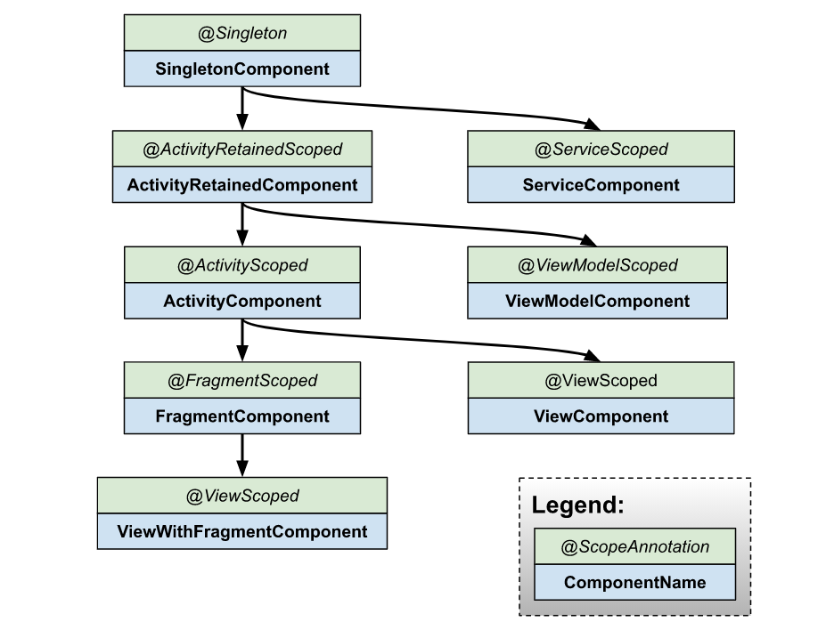

# Hilt
Hilt is a dependency injection library for Android that reduces the boilerplate of doing manual dependency injection in your project. Doing manual dependency injection requires you to construct every class and its dependencies by hand, and to use containers to reuse and manage dependencies.

Hilt provides a standard way to use DI in your application by providing containers for every Android class in your project and managing their lifecycles automatically. Hilt is built on top of the popular DI library Dagger to benefit from the compile-time correctness, runtime performance, scalability, and Android Studio support that Dagger provides.

With respect to Dagger, the goals of Hilt are as follows:
- To simplify Dagger-related infrastructure for Android apps;
- To create a standard set of components and scopes to ease setup, readability, and code sharing between apps;
- To provide an easy way to provision different bindings to various build types, such as testing, debug, or release.

Because the Android operating system instantiates many of its own framework classes, using Dagger in an Android app requires you to write a substantial amount of boilerplate. Hilt reduces the boilerplate code that is involved in using Dagger in an Android application. Hilt automatically generates and provides the following:
- **Components for integrating Android framework classes** with Dagger that you would otherwise need to create by hand;
- **Scope annotations** to use with the components that Hilt generates automatically;
- **Predefined bindings** to represent Android classes such as `Application` or `Activity`;
- **Predefined qualifiers** to represent `@ApplicationContext` and `@ActivityContext`.

## [Hilt application class](https://developer.android.com/training/dependency-injection/hilt-android#application-class)
All apps that use Hilt must contain an `Application` class that is annotated with `@HiltAndroidApp`.

`@HiltAndroidApp` triggers Hilt's code generation, including a base class for your application that serves as the application-level dependency container.

```
@HiltAndroidApp
class ExampleApplication : Application() { ... }
```
This generated Hilt component is attached to the `Application` object's lifecycle and provides dependencies to it. Additionally, it is the parent component of the app, which means that other components can access the dependencies that it provides.

## [Inject dependencies into Android classes](https://developer.android.com/training/dependency-injection/hilt-android#android-classes)
Once Hilt is set up in your `Application` class and an application-level component is available, Hilt can provide dependencies to other Android classes that have the `@AndroidEntryPoint` annotation:

```
@AndroidEntryPoint
class ExampleActivity : AppCompatActivity() { ... }
```

Hilt currently supports the following Android classes:
- `Application` (by using `@HiltAndroidApp`)
- `ViewModel` (by using `@HiltViewModel`)
- `Activity`
- `Fragment`
- `View`
- `Service`
- `BroadcastReceiver`

If you annotate an Android class with `@AndroidEntryPoint`, then you also must annotate Android classes that depend on it. For example, if you annotate a fragment, then you must also annotate any activities where you use that fragment.

`@AndroidEntryPoint` generates an individual Hilt component for each Android class in your project. These components can receive dependencies from their respective parent classes as described in Component hierarchy.

To obtain dependencies from a component, use the `@Inject` annotation to perform field injection:
```
@AndroidEntryPoint
class ExampleActivity : AppCompatActivity() {

  @Inject lateinit var analytics: AnalyticsAdapter
  ...
}
```
Classes that Hilt injects can have other base classes that also use injection. Those classes don't need the `@AndroidEntryPoint` annotation if they're abstract.

## [Define Hilt bindings](https://developer.android.com/training/dependency-injection/hilt-android#define-bindings)
To perform field injection, Hilt needs to know how to provide instances of the necessary dependencies from the corresponding component. A *binding* contains the information necessary to provide instances of a type as a dependency.

One way to provide binding information to Hilt is *constructor injection*. Use the `@Inject` annotation on the constructor of a class to tell Hilt how to provide instances of that class:
```
class AnalyticsAdapter @Inject constructor(
  private val service: AnalyticsService
) { ... }
```

The parameters of an annotated constructor of a class are the dependencies of that class. In the example, `AnalyticsAdapter` has `AnalyticsService` as a dependency. Therefore, Hilt must also know how to provide instances of `AnalyticsService`.

## [Hilt modules](https://developer.android.com/training/dependency-injection/hilt-android#hilt-modules)
Sometimes a type cannot be constructor-injected. This can happen for multiple reasons. For example, you cannot constructor-inject an interface. You also cannot constructor-inject a type that you do not own, such as a class from an external library. In these cases, you can provide Hilt with binding information by using *Hilt modules*.

A Hilt module is a class that is annotated with `@Module`. Like a Dagger module, it informs Hilt how to provide instances of certain types. Unlike Dagger modules, you must annotate Hilt modules with `@InstallIn` to tell Hilt which Android class each module will be used or installed in.

Dependencies that you provide in Hilt modules are available in all generated components that are associated with the Android class where you install the Hilt module.

## [Component lifetimes](https://developer.android.com/training/dependency-injection/hilt-android#component-lifetimes)
Hilt automatically creates and destroys instances of generated component classes following the lifecycle of the corresponding Android classes.

| Generated component	 | Created at	 | Destroyed at |
|---|---|---|
| SingletonComponent  | Application#onCreate()  | Application#onDestroy()  |
| ActivityRetainedComponent  | Activity#onCreate() | Activity#onDestroy() |
| ViewModelComponent  | ViewModel created | ViewModel destroyed |
| ActivityComponent  | Activity#onCreate() | Activity#onDestroy() |
| FragmentComponent  | Fragment#onAttach() | Fragment#onDestroy() |
| ViewComponent  | View#super() | View destroyed |
| ViewWithFragmentComponent  | View#super() | View destroyed |
| ServiceComponent  | Service#onCreate() | Service#onDestroy() |

## [Component hierarchy](https://developer.android.com/training/dependency-injection/hilt-android#component-hierarchy)
Installing a module into a component allows its bindings to be accessed as a dependency of other bindings in that component or in any child component below it in the component hierarchy:



# Links
[Dependency injection with Hilt](https://developer.android.com/training/dependency-injection/hilt-android#hilt-and-dagger)

# Futher reading
[Dependency injection on Android with Hilt](https://medium.com/androiddevelopers/dependency-injection-on-android-with-hilt-67b6031e62d)  
[Scoping in Android and Hilt](https://medium.com/androiddevelopers/scoping-in-android-and-hilt-c2e5222317c0)  
[Hilt — Adding components to the hierarchy](https://medium.com/androiddevelopers/hilt-adding-components-to-the-hierarchy-96f207d6d92d)  
[Migrating the Google I/O app to Hilt](https://medium.com/androiddevelopers/migrating-the-google-i-o-app-to-hilt-f3edf03affe5)
