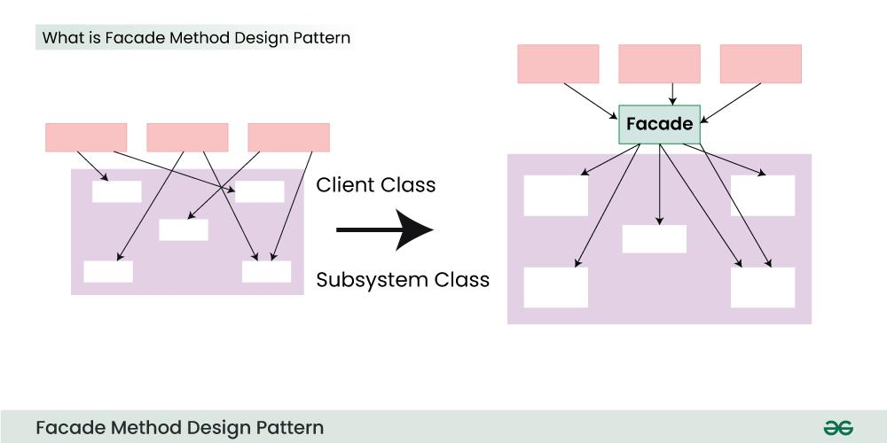

# Facade pattern
Facade pattern is one of **structural design pattern** among other Gang of Four design patterns. The facade pattern is appropriate when we have a complex system that we want to expose to clients in a simplified way. Its purpose is to hide internal complexity behind a single interface that appears simple from the outside.<sup>[1](https://howtodoinjava.com/design-patterns/structural/facade-design-pattern/#:~:text=Facade%20pattern%20is,from%20the%20outside.)</sup>

What problems can the Facade design pattern solve?
- To make a complex subsystem easier to use, a simple interface should be provided for a set of interfaces in the subsystem;
- The dependencies on a subsystem should be minimized.<sup>[2](https://en.wikipedia.org/wiki/Facade_pattern#:~:text=What%20problems%20can,should%20be%20minimized.)</sup>

Key Points of the Facade Pattern:<sup>[3](https://medium.com/@naimish-trivedi/facade-design-pattern-in-android-3eb959df5478#:~:text=Key%20Points%20of%20the%20Facade%20Pattern%3A)</sup>
- **Simplification**. It provides a simplified interface to a complex system of classes;
- **Decoupling**. It decouples the client code from the internal workings of the system;
- **Easier Maintenance**. It allows for easier maintenance, as changes in the underlying subsystems don’t directly affect the client code;


In the above diagram<sup>[4](https://www.geeksforgeeks.org/facade-design-pattern-introduction/#:~:text=In%20the%20above,of%20a%20subsystem.)</sup>:
- Structuring a system into subsystems helps reduce complexity;
- A common design goal is to minimize the communication and dependencies between subsystems;
- One way to achieve this goal is to introduce a Facade object that provides a single simplified interface to the more general facilities of a subsystem.

## [Use Cases of Facade Method Design Pattern](https://www.geeksforgeeks.org/facade-design-pattern-introduction/#:~:text=all%20the%20complexities.-,Use%20Cases%20of%20Facade%20Method%20Design%20Pattern,-Simplifying%20Complex%20External)
- **Simplifying Complex External Systems**:
  - A facade encapsulates database connection, query execution, and result processing, offering a clean interface to the application;
  - A facade simplifies the usage of external APIs by hiding the complexities of authentication, request formatting, and response parsing;
- **Layering Subsystems**:
  - Facades define clear boundaries between subsystems, reducing dependencies and promoting modularity;
  - Facades offer simplified interfaces to lower-level subsystems, making them easier to understand and use;
- **Providing a Unified Interface to Diverse Systems**:
  - A facade can combine multiple APIs into a single interface, streamlining interactions and reducing code duplication;
  - A facade can create a modern interface for older, less accessible systems, facilitating their integration with newer components;
- **Protecting Clients from Unstable Systems**:
  - Facades minimize the impact of changes to underlying systems by maintaining a stable interface;
  - Facades can protect clients from changes or issues in external libraries or services.

## [Example](https://www.javaguides.net/2023/10/facade-design-pattern-in-kotlin.html#google_vignette:~:text=Implementation%20in%20Kotlin%20Programming)
```
// Subsystems
class Lights {
    fun dim() {
        println("Lights dimmed.")
    }
}
class Blinds {
    fun lower() {
        println("Blinds lowered.")
    }
}
class Projector {
    fun turnOn() {
        println("Projector turned on.")
    }
}
class MoviePlayer {
    fun play() {
        println("Movie started playing.")
    }
}
// Facade
class HomeTheaterFacade(
    private val lights: Lights,
    private val blinds: Blinds,
    private val projector: Projector,
    private val moviePlayer: MoviePlayer
) {
    fun watchMovie() {
        lights.dim()
        blinds.lower()
        projector.turnOn()
        moviePlayer.play()
    }
}
fun main() {
    val homeTheater = HomeTheaterFacade(Lights(), Blinds(), Projector(), MoviePlayer())
    homeTheater.watchMovie()
}
```

Output:
```
Lights dimmed.
Blinds lowered.
Projector turned on.
Movie started playing.
```

## [Advantages of Facade Method Design Pattern](https://www.geeksforgeeks.org/facade-design-pattern-introduction/#:~:text=libraries%20or%20services.-,Advantages%20of%20Facade%20Method%20Design%20Pattern,-Simplified%20Interface%3A)
- **Simplified Interface**:
  - Simplifies the use and understanding of a complex system by offering a clear and concise interface;
  - Hides the internal details of the system, reducing cognitive load for clients;
- **Reduced Coupling**:
  - Clients become less reliant on the internal workings of the underlying system when they are disconnected from it;
  - Encourages the reusability and modularity of code components;
  - Allows for the independent testing and development of various system components;
- **Encapsulation**:
  - Encapsulates the complex interactions within a subsystem, protecting clients from changes in its implementation;
  - Allows for changes to the subsystem without affecting clients, as long as the facade interface remains stable;
- **Improved Maintainability**:
  - Easier to change or extend the underlying system without affecting clients, as long as the facade interface remains consistent;
  - Allows for refactoring and optimization of the subsystem without impacting client code.

## [Disadvantages of Facade Method Design Pattern](https://www.geeksforgeeks.org/facade-design-pattern-introduction/#:~:text=impacting%20client%20code.-,Disadvantages%20of%20Facade%20Method%20Design%20Pattern,-Increased%20Complexity%3A)
- **Increased Complexity**:
  - Adding the facade layer in the system increases the level of abstraction;
  - Because of this, the code may be more difficult to understand and debug;
- **Reduced Flexibility**:
  - The facade acts as a single point of access to the underlying system;
  - This can limit the flexibility for clients who need to bypass the facade or access specific functionalities hidden within the subsystem;
- **Overengineering**:
  - Applying the facade pattern to very simple systems can be overkill, adding unnecessary complexity where it’s not needed;
  - Consider the cost-benefit trade-off before implementing a facade for every situation;
- **Potential Performance Overhead**:
  - Adding an extra layer of indirection through the facade can introduce a slight performance overhead, especially for frequently used operations;
  - This may not be significant for most applications, but it’s worth considering in performance-critical scenarios.

# Links
[Facade Design Pattern](https://howtodoinjava.com/design-patterns/structural/facade-design-pattern/)

[Facade pattern](https://en.wikipedia.org/wiki/Facade_pattern)

[Facade Design Pattern in Android](https://medium.com/@naimish-trivedi/facade-design-pattern-in-android-3eb959df5478)

[Facade Method Design Pattern](https://www.geeksforgeeks.org/facade-design-pattern-introduction/)

[Facade Design Pattern in Kotlin](https://www.javaguides.net/2023/10/facade-design-pattern-in-kotlin.html#google_vignette)

# Further reading
[Facade](https://refactoring.guru/design-patterns/facade)
