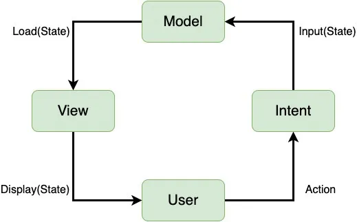

# MVI pattern
**MVI** stands for **Model-View-Intent**. MVI is one of the newest architecture patterns for Android, inspired by the unidirectional and cyclical nature of the Cycle.js framework.

MVI works in a very different way compared to its distant relatives, MVC, MVP or MVVM. The role of each MVI components is as follows:
- **Model** represents a state. Models in MVI should be immutable to ensure a unidirectional data flow between them and the other layers in your architecture;
- Like in MVP, Interfaces in MVI represent **Views**, which are then implemented in one or more Activities or Fragments;
- **Intent** represents an intention or a desire to perform an action, either by the user or the app itself. For every action, a View receives an Intent. The Presenter observes the Intent, and Models translate it into a new state. [1](https://www.kodeco.com/817602-mvi-architecture-for-android-tutorial-getting-started#:~:text=MVI%20stands%20for,a%20new%20state.)

## [MVI Workflow](https://krishanmadushankadev.medium.com/android-mvi-model-view-intent-architecture-example-code-bc7dc8edb33#:~:text=the%20app%20itself.-,MVI%20Workflow,-As%20you%20can)

As you can see in the diagram the flow goes like this:
- User interaction happen which will be an Intent;
- Intent is a state which is an input to model;
- Model stores state and send the requested state to the View;
- View Loads the state from Model;
- Updated UI is displayed to the user.

Using this architecture brings the following benefits[2](https://proandroiddev.com/mvi-a-new-member-of-the-mv-band-6f7f0d23bc8a#:~:text=Using%20this%20architecture,the%20message%20again.):
- **No state problem** anymore, because there is only one state for our app, which is a single source of truth;
- **Unidirectional data flow**, which makes the logic of our app more predictable and easier to understand;
- **Immutability** — as long as each output is an immutable object, we can take advantage of the benefits associated with immutability (thread safety or share-ability);
- **Debuggability** — unidirectional data flow ensures that our app is easy to debug. Every time we pass our data from one component to another, we can log the current value of the outflow. Thus, when we get a bug report, we can see the state our app was in when the error was made, and we can even see the user’s intent under which this state was created;
- **Decoupled logic**, because each component has its own responsibility;
- **Testability** — all we have to do to write the unit test for our app is call a proper business method and check if we’ve got a proper state.

However, nothing is perfect, and there are some drawbacks, you should be aware of before using MVI:
- **A lot of boilerplate** — each small UI change has to start with a user’s intent and then must pass the whole circle. Even with the easiest implementation, you have to create at least an intent and a state object for every action made in our app;
- **Complexity** — there is a lot of logic inside which must be strictly followed, and there is a high probability that not everybody knows about it. This may cause problems especially when you need to expand your team as it will take more time for newcomers to get used to it;
- **Object creation**, which is expensive. If too many objects are created, your heap memory can easily reach full capacity and then your garbage collector will be too busy. You should strike a balance between the structure and size of your app;
- **SingleLiveEvents**. To create these with MVI architecture (for example displaying a snackbar message), you should have a state with `showMessage = true` attribute and render it by showing the snackbar. However, what if a config change comes into play? Then you should display the latest state, which would present the snackbar again. Although that’s correct behavior, it is not so user friendly. We have to create another state telling us not to display the message again.

# Links
[MVI Architecture for Android Tutorial: Getting Started](https://www.kodeco.com/817602-mvi-architecture-for-android-tutorial-getting-started)

[Android MVI (Model-View-Intent) Architecture — Example code](https://krishanmadushankadev.medium.com/android-mvi-model-view-intent-architecture-example-code-bc7dc8edb33)

[MVI — another member of the MV* band](https://proandroiddev.com/mvi-a-new-member-of-the-mv-band-6f7f0d23bc8a)

# Futher reading
[MVI with state-machine. Basics.](https://proandroiddev.com/mvi-architecture-with-a-state-machine-basics-721c5ebed893)

[Reactive Apps with Model-View-Intent - Part 1: Model](http://hannesdorfmann.com/android/mosby3-mvi-1/)

[The famous and unthought MVI misconception in Android, alongside MVVM](https://funkymuse.dev/posts/the-story-of-mvi/)

[Getting started with MVI Architecture on Android](https://ericampire.com/getting-started-with-mvi-architecture-on-android-b2c280b7023)

[Best Architecture For Android : MVI + LiveData + ViewModel = ❤️](https://proandroiddev.com/best-architecture-for-android-mvi-livedata-viewmodel-71a3a5ac7ee3)

[MVI - The Good, the Bad, and the Ugly](https://adambennett.dev/2019/07/mvi-the-good-the-bad-and-the-ugly/)
