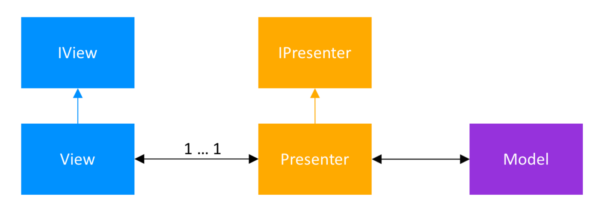

# MVP pattern
MVP is an architectural pattern engineered to facilitate automated unit testing and improve the separation of concerns in presentation logic.

Role of components: 
- **Model** - the data layer. Responsible for handling the business logic and communication with the network and database layers;
- **View** - the UI layer. Displays the data and notifies the Presenter about user actions;
- **Presenter** - retrieves the data from the Model, applies the UI logic and manages the state of the View, decides what to display and reacts to user input notifications from the View.

Since the View and the Presenter work closely together, they need to have a reference to one another. To make the Presenter unit testable with JUnit, the View is abstracted and an interface for it used. The relationship between the Presenter and its corresponding View is defined in a `Contract` interface class, making the code more readable and the connection between the two easier to understand.

## Why Use MVP?
This MVP design pattern helps to segregate code into three different parts: business logic (Presenter); UI (View); data interaction (Model). This modulation of code is easy to understand and maintain.

For example: In our application, if we use a content provider to persist our data and later we want to upgrade it with a SQLite database, the MVP design pattern will make this very easy.

## Disadvantages of Model-View-Presenter Pattern
The Model-View-Presenter pattern brings with it a very good separation of concerns. While this is for sure a pro, when developing a small app or a prototype, this can seem like an overhead. To decrease the number of interfaces used, some developers remove the `Contract` interface class, and the interface for the Presenter.

One of the pitfalls of MVP appears when moving the UI logic to the Presenter: this becomes now an all-knowing class, with thousands of lines of code. To solve this, split the code even more and remember to create classes that have only one responsibility and are unit testable.

## Example
Due to the fact that it is necessary to demonstrate a large amount of code, I will give only links to an examples:
- [Building An Application With MVP](https://androidessence.com/building-an-app-with-mvp)
- [Android MVP Architecture for Beginners (Demo App)](https://androidwave.com/android-mvp-architecture-for-beginners-demo-app/)
- [Android MVP](https://www.journaldev.com/14886/android-mvp)

## Conclusion
 Advantages of MVP Architecture:
 - No conceptual relationship in android components;
 - Easy code maintenance and testing as the application’s model, view, and presenter layer are separated.

Disadvantages of MVP Architecture:
- If the developer does not follow the single responsibility principle to break the code then the Presenter layer tends to expand to a huge all-knowing class.

# Links
[Model–view–presenter](https://en.wikipedia.org/wiki/Model%E2%80%93view%E2%80%93presenter)

[Android Architecture Patterns Part 2:
Model-View-Presenter](https://medium.com/upday-devs/android-architecture-patterns-part-2-model-view-presenter-8a6faaae14a5)

[MVP (Model View Presenter) Architecture Pattern in Android with Example](https://www.geeksforgeeks.org/mvp-model-view-presenter-architecture-pattern-in-android-with-example/)

[Model-View-Presenter (MVP) for Android](https://dzone.com/articles/model-view-presenter-for-andriod)

# Futher reading
[Building An Application With MVP](https://androidessence.com/building-an-app-with-mvp)

[Android MVP Architecture for Beginners (Demo App)](https://androidwave.com/android-mvp-architecture-for-beginners-demo-app/)

[Android MVP](https://www.journaldev.com/14886/android-mvp)

[Android Model View Presenter MVP Pattern Example](https://www.zoftino.com/android-model-view-presenter-mvp-pattern-example)
