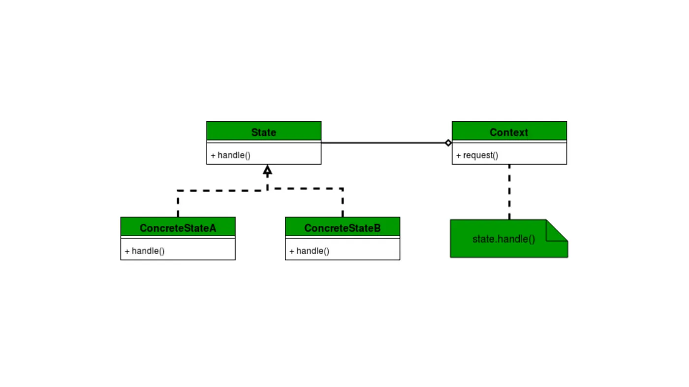

# State pattern
The state pattern is a behavioral software design pattern that allows an object to alter its behavior when its internal state changes.<sup>[1](https://en.wikipedia.org/wiki/State_pattern#:~:text=The%20state%20pattern%20is%20a%20behavioral%20software%20design%20pattern%20that%20allows%20an%20object%20to%20alter%20its%20behavior%20when%20its%20internal%20state%20changes.)</sup>

The state pattern is used to encapsulate varying behavior for the same object, based on its internal state. This can be a cleaner way for an object to change its behavior at runtime without resorting to conditional statements and thus improve maintainability.<sup>[2](https://en.wikipedia.org/wiki/State_pattern#:~:text=The%20state%20pattern%20is%20used%20in%20computer%20programming%20to%20encapsulate%20varying%20behavior%20for%20the%20same%20object%2C%20based%20on%20its%20internal%20state.%20This%20can%20be%20a%20cleaner%20way%20for%20an%20object%20to%20change%20its%20behavior%20at%20runtime%20without%20resorting%20to%20conditional%20statements%20and%20thus%20improve%20maintainability.)</sup>

The state pattern is set to solve two main problems:
- An object should change its behavior when its internal state changes;
- State-specific behavior should be defined independently. That is, adding new states should not affect the behavior of existing states.

Implementing state-specific behavior directly within a class is inflexible because it commits the class to a particular behavior and makes it impossible to add a new state or change the behavior of an existing state later, independently from the class, without changing the class. In this, the pattern describes two solutions:
- Define separate (state) objects that encapsulate state-specific behavior for each state. That is, define an interface (state) for performing state-specific behavior, and define classes that implement the interface for each state;
- A class delegates state-specific behavior to its current state object instead of implementing state-specific behavior directly.

This makes a class independent of how state-specific behavior is implemented. New states can be added by defining new state classes. A class can change its behavior at run-time by changing its current state object.<sup>[3](https://en.wikipedia.org/wiki/State_pattern#:~:text=The%20state%20pattern%20is%20set,changing%20its%20current%20state%20object.)</sup>

## [Key Features of the State Pattern](https://medium.com/softaai-blogs/gain-clarity-on-the-state-design-pattern-in-kotlin-a-step-by-step-guide-4f768db2cc03#:~:text=Key%20Features%20of%20the%20State%20Pattern)
- **State Encapsulation**. Each state is encapsulated in its own class;
- **Behavioral Changes**. Behavior changes dynamically as the object’s state changes;
- **No Conditionals**. It eliminates long if-else or when chains by using polymorphism.

## [Example](https://medium.com/softaai-blogs/gain-clarity-on-the-state-design-pattern-in-kotlin-a-step-by-step-guide-4f768db2cc03#:~:text=Structure%20of%20the%20State%20Design%20Pattern)
State pattern encapsulates state-specific behavior into separate classes and delegates state transitions to these objects. Here’s a breakdown of its structure:



### [State Interface](https://medium.com/softaai-blogs/gain-clarity-on-the-state-design-pattern-in-kotlin-a-step-by-step-guide-4f768db2cc03#:~:text=of%20its%20structure%3A-,State%20Interface,-The%20State%20Interface)

The `State` interface defines the methods that each state will implement. It provides a common contract for all concrete states:
```
interface State {
    fun handle(context: Context)
}
```

- The `State` interface declares a single method, `handle(context: Context)`, which the `Context` calls to delegate behavior;
- Each concrete state will define its behavior within this method.

### [Concrete States](https://medium.com/softaai-blogs/gain-clarity-on-the-state-design-pattern-in-kotlin-a-step-by-step-guide-4f768db2cc03#:~:text=within%20this%20method.-,Concrete%20States,-The%20Concrete%20States)
The **Concrete States** implement the `State` interface. Each represents a specific state and its associated behavior:
```
class ConcreteStateA : State {
    override fun handle(context: Context) {
        println("State A: Handling request and transitioning to State B")
        context.setState(ConcreteStateB()) // Transition to State B
    }
}

class ConcreteStateB : State {
    override fun handle(context: Context) {
        println("State B: Handling request and transitioning to State A")
        context.setState(ConcreteStateA()) // Transition to State A
    }
}
```

- `ConcreteStateA` and `ConcreteStateB` implement the `State` interface and define their unique behavior;
- Each state determines the next state and triggers a transition using the `context.setState()` method.

### [Context](https://medium.com/softaai-blogs/gain-clarity-on-the-state-design-pattern-in-kotlin-a-step-by-step-guide-4f768db2cc03#:~:text=context.setState()%20method.-,Context,-The%20Context%20is)
The `Context` is the class that maintains a reference to the current state and delegates behavior to it:
```
class Context {
    private var currentState: State? = null

    fun setState(state: State) {
        currentState = state
        println("Context: State changed to ${state::class.simpleName}")
    }

    fun request() {
        currentState?.handle(this) ?: println("Context: No state is set")
    }
}
```

- The `Context` class holds a reference to the current state via `currentState`;
- The `setState()` method updates the current state and logs the transition;
- The `request()` method delegates the action to the current state's `handle()` method.

### [Test the Implementation](https://medium.com/softaai-blogs/gain-clarity-on-the-state-design-pattern-in-kotlin-a-step-by-step-guide-4f768db2cc03#:~:text=state%27s%20handle()%20method.-,Test%20the%20Implementation,-Finally%2C%20we%20can)
Finally, we can create a main function to test the transitions between states:
```
fun main() {
    val context = Context()

    // Set initial state
    context.setState(ConcreteStateA())

    // Trigger behavior and transition between states
    context.request() // State A handles and transitions to State B
    context.request() // State B handles and transitions to State A
    context.request() // State A handles and transitions to State B
}
```

Output:
```
Context: State changed to ConcreteStateA
State A: Handling request and transitioning to State B
Context: State changed to ConcreteStateB
State B: Handling request and transitioning to State A
Context: State changed to ConcreteStateA
State A: Handling request and transitioning to State B
Context: State changed to ConcreteStateB
```

How These Components Work Together:
- The `Context` is the central point of interaction for the client code. It contains a reference to the current state;
- The `State` interface ensures that all states adhere to a consistent set of behaviors;
- The **Concrete States** (`ConcreteStateA` and `ConcreteStateB`) implement specific behavior for the `Context` and may trigger transitions to other states;
- When a client invokes a method on the `Context`, the `Context` delegates the behavior to the current state, which executes the appropriate logic.

## [Real world example of state pattern](https://howtodoinjava.com/design-patterns/behavioral/state-design-pattern/#:~:text=2.-,Real%20world%20example%20of%20state%20pattern,-To%20make%20things)
- To make things simple, let’s visualize a **TV box** operated with remote controller. We can change the state of TV by pressing buttons on remote. But the state of TV will change or not, it depends on the current state of the TV. If TV is ON, we can switch it OFF, mute or change aspects and source. But if TV is OFF, nothing will happen when we press remote buttons. For a switched OFF TV only possible next state can be switch ON;
- Another example can be of [Java thread states](https://howtodoinjava.com/java/multi-threading/java-thread-life-cycle-and-thread-states/). A thread can be one of its five states during it’s life cycle. It’s next state can be determined only after getting it’s current state. e.g. we can not start a stopped thread or we cannot a make a thread wait, until it has started running.

# Links
[State pattern](https://en.wikipedia.org/wiki/State_pattern)

[Gain Clarity on the State Design Pattern in Kotlin: A Step-by-Step Guide](https://medium.com/softaai-blogs/gain-clarity-on-the-state-design-pattern-in-kotlin-a-step-by-step-guide-4f768db2cc03)

[State Design Pattern](https://howtodoinjava.com/design-patterns/behavioral/state-design-pattern/)

# Further reading
[Mastering the State Pattern in Kotlin: A Dive into Behavior Transitions](https://medium.com/@shahin.cse.sust/mastering-the-state-pattern-in-kotlin-a-dive-into-behavior-transitions-6fc977fc11c4)

[State Design Pattern](https://sourcemaking.com/design_patterns/state)

[State pattern for changing internal processes](https://blog.devgenius.io/state-pattern-for-changing-internal-processes-kotlin-72bd4ef92b2e)
