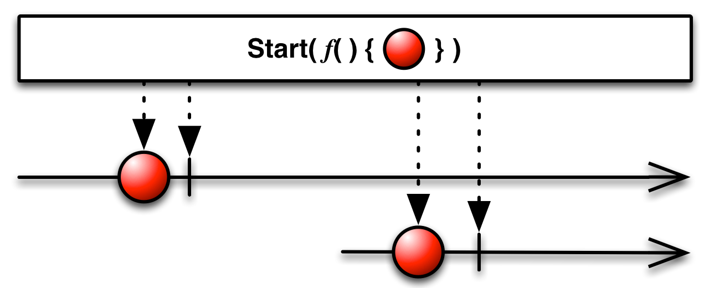

# Creating Operators
Operators that originate new Observables.
- `Create` — create an `Observable` from scratch by calling observer methods programmatically;
- `Defer` — do not create the `Observable` until the observer subscribes, and create a fresh `Observable` for each observer;
- `Empty/Never/Throw` — create Observables that have very precise and limited behavior;
- `From` — convert some other object or data structure into an `Observable`;
- `Interval` — create an `Observable` that emits a sequence of integers spaced by a particular time interval;
- `Just` — convert an object or a set of objects into an `Observable` that emits that or those objects;
- `Range` — create an `Observable` that emits a range of sequential integers;
- `Repeat` — create an `Observable` that emits a particular item or sequence of items repeatedly;
- `Start` — create an `Observable` that emits the return value of a function;
- `Timer` — create an `Observable` that emits a single item after a given delay.

### [Create](http://reactivex.io/documentation/operators/create.html)
Сreate an `Observable` from scratch by means of a function. You can create an `Observable` from scratch by using the *Create* operator. You pass this operator a function that accepts the observer as its parameter. Write this function so that it behaves as an `Observable` — by calling the observer’s `onNext`, `onError`, and `onCompleted` methods appropriately.

A well-formed finite `Observable` must attempt to call either the observer’s `onCompleted` method exactly once or its `onError` method exactly once, and must not thereafter attempt to call any of the observer’s other methods.


```
fun create() {
    Observable.create<Int> { source ->
        try {
            if (!source.isDisposed) {
                for (i in 0..5) {
                    source.onNext(i)
                }

                source.onComplete()
            }
        } catch (e: Exception) {
            source.onError(e)
        }
    }.subscribe(
            { result -> println("Next item = $result") },
            { println("onError") },
            { println("onComplete") }
    )
}
```

Output:
```
Next item = 0
Next item = 1
Next item = 2
Next item = 3
Next item = 4
Next item = 5
onComplete
```

### [Defer](http://reactivex.io/documentation/operators/defer.html)
Do not create the `Observable` until the observer subscribes, and create a fresh `Observable` for each observer. The *Defer* operator waits until an observer subscribes to it, and then it generates an `Observable`, typically with an `Observable` factory function. It does this afresh for each subscriber, so although each subscriber may think it is subscribing to the same `Observable`, in fact each subscriber gets its own individual sequence.


```
fun defer() {
    var value = "Default"

    val defaultObservable = Observable.create<String> { Observable.just(value) }
    val deferObservable = Observable.defer { Observable.just(value) }

    value = "Not Default Value"

    defaultObservable.subscribe { result -> println("Next item (default observable) = $result") }
    deferObservable.subscribe { result -> println("Next item (defer observable) = $result") }
}
```

Output:
```
Next item (defer observable) = Not Default Value
```

### [Empty/Never/Throw](http://reactivex.io/documentation/operators/empty-never-throw.html)
The *Empty*, *Never*, and *Throw* operators generate Observables with very specific and limited behavior. These are useful for testing purposes, and sometimes also for combining with other Observables or as parameters to operators that expect other Observables as parameters.

- `Empty` - create an `Observable` that emits no items but terminates normally;


- `Never` - create an `Observable` that emits no items and does not terminate;


- `Throw` - create an `Observable` that emits no items and terminates with an error.


### [From](http://reactivex.io/documentation/operators/from.html)
Convert various other objects and data types into Observables. 

When you work with Observables, it can be more convenient if all of the data you mean to work with can be represented as Observables, rather than as a mixture of Observables and other types. This allows you to use a single set of operators to govern the entire lifespan of the data stream.

`Iterables`, for example, can be thought of as a sort of synchronous `Observable`; `Futures`, as a sort of `Observable` that always emits only a single item. By explicitly converting such objects to Observables, you allow them to interact as peers with other Observables.


```
fun from() {
    val array = arrayOf(1, 2, 3, 4, 5, 6)

    Observable.fromArray(array)
            .subscribe{ result -> println("Next item = ${result.toList()}") }
}
```

Output:
```
Next item = [1, 2, 3, 4, 5, 6]
```

### [Interval](http://reactivex.io/documentation/operators/interval.html)
Create an `Observable` that emits a sequence of integers spaced by a given time interval. The *Interval* operator returns an `Observable` that emits an infinite sequence of ascending integers, with a constant interval of time of your choosing between emissions.


```
fun interval() {
    Observable.interval(1, TimeUnit.SECONDS)
            .subscribe{ result -> println("Next item = $result") }
}
```

Output (emits with interval 1 second):
```
Next item = 0
Next item = 1
Next item = 2
Next item = 3
Next item = 4
Next item = 5
Next item = 6
...
```

### [Just](http://reactivex.io/documentation/operators/just.html)
Create an `Observable` that emits a particular item. The *Just* operator converts an item into an `Observable` that emits that item. 

*Just* is similar to *From*, but note that *From* will dive into an array or an iterable or something of that sort to pull out items to emit, while *Just* will simply emit the array or iterable or what-have-you as it is, unchanged, as a single item.

**Note** that if you pass `null` to *Just*, it will return an `Observable` that emits `null` as an item. Do not make the mistake of assuming that this will return an empty `Observable` (one that emits no items at all). For that, you will need the *Empty* operator.


```
fun just() {
    Observable.just(1, 2, 3)
            .subscribe(
                    { result -> println("Next item = $result") },
                    { println("onError") },
                    { println("onComplete") }
            )
}
```

Output:
```
Next item = 1
Next item = 2
Next item = 3
onComplete
```

### [Range](http://reactivex.io/documentation/operators/range.html)
Create an `Observable` that emits a particular range of sequential integers. The *Range* operator emits a range of sequential integers, in order, where you select the start of the range and its length.


```
fun range() {
    Observable.range(0, 5)
            .subscribe(
                    { result -> println("Next item = $result") },
                    { println("onError") },
                    { println("onComplete") }
            )
}
```

Output:
```
Next item = 0
Next item = 1
Next item = 2
Next item = 3
Next item = 4
onComplete
```

### [Repeat](http://reactivex.io/documentation/operators/repeat.html)
Create an `Observable` that emits a particular item multiple times. The *Repeat* operator emits an item repeatedly.


```
fun repeat() {
    Observable.just(1, 2, 3)
            .repeat(3)
            .subscribe(
                    { result -> println("Next item = $result") },
                    { println("onError") },
                    { println("onComplete") }
            )
}
```

Output:
```
Next item = 1
Next item = 2
Next item = 3
Next item = 1
Next item = 2
Next item = 3
Next item = 1
Next item = 2
Next item = 3
onComplete
```

### [Start](http://reactivex.io/documentation/operators/start.html)
Create an `Observable` that emits the return value of a function-like directive. There are a number of ways that programming languages have for obtaining values as the result of calculations, with names like functions, futures, actions, callables, runnables, and so forth. The operators grouped here under the *Start* operator category make these things behave like `Observables` so that they can be chained with other Observables in an `Observable` cascade.

In RxJava 2 method - `fromCallable` represents logic of start operator. 



```
fun start() {
    Observable.fromCallable { someFunction() }
            .subscribe(
                    { result -> println("Next item = $result") },
                    { println("onError") },
                    { println("onComplete") }
            )
}

fun someFunction() = "Example"
```

Output:
```
Next item = Example
```

### [Timer](http://reactivex.io/documentation/operators/timer.html)
Create an `Observable` that emits a particular item after a given delay. The *Timer* operator creates an `Observable` that emits one particular item after a span of time that you specify.


```
fun timer() {
    Observable.timer(5, TimeUnit.SECONDS)
            .subscribe(
                    { result -> println("Next item = $result") },
                    { println("onError") },
                    { println("onComplete") }
            )
}
```

Output (after 5 seconds):
```
Next item = 0
onComplete
```

# Links
http://reactivex.io/documentation/operators.html  
http://reactivex.io/documentation/operators/create.html  
http://reactivex.io/documentation/operators/defer.html  
http://reactivex.io/documentation/operators/empty-never-throw.html  
http://reactivex.io/documentation/operators/from.html  
http://reactivex.io/documentation/operators/interval.html  
http://reactivex.io/documentation/operators/just.html  
http://reactivex.io/documentation/operators/range.html  
http://reactivex.io/documentation/operators/repeat.html  
http://reactivex.io/documentation/operators/start.html  
http://reactivex.io/documentation/operators/timer.html
