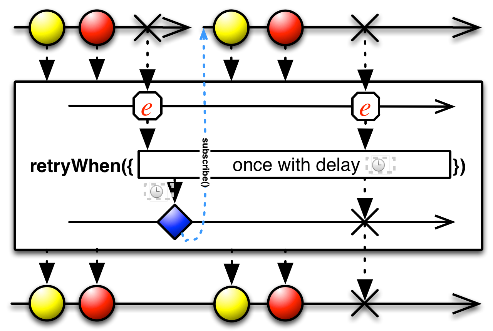

# Error handling operators
Operators that help to recover from error notifications from an `Observable`.
- `Catch` — recover from an `onError` notification by continuing the sequence without error;
- `Retry` — if a source `Observable` sends an onError notification, resubscribe to it in the hopes that it will complete without error.

### [Catch](http://reactivex.io/documentation/operators/catch.html)
Recover from an `onError` notification by continuing the sequence without error. 

The *Catch* operator intercepts an `onError` notification from the source `Observable` and, instead of passing it through to any observers, replaces it with some other item or sequence of items, potentially allowing the resulting `Observable` to terminate normally or not to terminate at all.


RxJava implements the *Catch* operator with three distinct operators:
- `onErrorReturn` - instructs an `Observable` to emit a particular item when it encounters an error, and then terminate normally;
- `onErrorResumeNext` - instructs an `Observable` to begin emitting a second `Observable` sequence if it encounters an error;
- `onExceptionResumeNext` - instructs an `Observable` to continue emitting items after it encounters an exception (but not another variety of throwable).

#### onErrorReturn
The `onErrorReturn` method returns an `Observable` that mirrors the behavior of the source `Observable`, unless that `Observable` invokes `onError` in which case, rather than propagating that error to the observer, `onErrorReturn` will instead emit a specified item and invoke the observer’s `onCompleted` method.


```
fun onErrorReturn() {
    Observable.just("10B")
            .map { number -> Integer.parseInt(number) }
            .onErrorReturn { error ->
                if (error is NumberFormatException) return@onErrorReturn 0
                else throw IllegalArgumentException()
            }
            .subscribe(
                    { result -> println("Next item = $result") },
                    { println("onError") },
                    { println("onComplete") }
            )
}
```

Output:
```
Next item = 0
onComplete
```

#### onErrorResumeNext
The `onErrorResumeNext` method returns an `Observable` that mirrors the behavior of the source `Observabl`e, unless that `Observable` invokes onError in which case, rather than propagating that error to the observer, `onErrorResumeNext` will instead begin mirroring a second, backup `Observable`.


```
fun onErrorResumeNext() {
    Observable
            .error<String>(Exception("Some error message"))
            .onErrorResumeNext(Observable.just("first", "second"))
            .subscribe(
                    { result -> println("Next item = $result") },
                    { println("onError") },
                    { println("onComplete") }
            )
}
```

Output:
```
Next item = first
Next item = second
```

#### onExceptionResumeNext
Much like `onErrorResumeNext` method, this returns an `Observable` that mirrors the behavior of the source `Observable`, unless that `Observable` invokes `onError` in which case, if the `Throwable` passed to `onError` is an `Exception`, rather than propagating that `Exception` to the observer, `onExceptionResumeNext` will instead begin mirroring a second, backup `Observable`. If the `Throwable` is not an `Exception`, the `Observable` returned by `onExceptionResumeNext` will propagate it to its observer’s `onError` method and will not invoke its backup `Observable`.


```
fun onExceptionResumeNext() {
    println("First observable")
    Observable
            .error<String>(Exception("Some error message"))
            .onExceptionResumeNext(Observable.just("Not error value"))
            .subscribe(
                    { result -> println("Next item = $result") },
                    { println("onError") },
                    { println("onComplete") }
            )

    println("Second observable")
    Observable
            .error<String>(Throwable("Some error message"))
            .onExceptionResumeNext(Observable.just("Not error value"))
            .subscribe(
                    { result -> println("Next item = $result") },
                    { println("onError") },
                    { println("onComplete") }
            )
}
```

Output:
```
First observable
Next item = Not error value
onComplete
Second observable
onError
```

### [Retry](http://reactivex.io/documentation/operators/retry.html)
If a source `Observable` emits an error, resubscribe to it in the hopes that it will complete without error. 

The *Retry* operator responds to an `onError` notification from the source `Observable` by not passing that call through to its observers, but instead by resubscribing to the source `Observable` and giving it another opportunity to complete its sequence without error. *Retry* always passes `onNext` notifications through to its observers, even from sequences that terminate with an error, so this can cause duplicate emissions (as shown in the diagram below). 


RxJava has two versions of this operator: `retry` and `retryWhen`.

#### Retry
One variant of retry takes no parameters. It will continue to resubscribe to and mirror the source `Observable` no matter how many `onError` notifications it receives.

Another variant of `retry` takes a single parameter: a count of the number of times it should try to resubscribe to the source `Observable` when it encounters errors. If this count is exceeded, retry will not attempt to resubscribe again and will instead pass the latest `onError` notification to its observers.

A third variant of `retry` takes a predicate function as a parameter. You write this function to accept two arguments: an `Integer` count of how many retries have taken place thusfar, and a `Throwable` indicating the error that caused the `onError` notification. This function returns a `Boolean` to indicate whether or not retry should resubscribe to and mirror the source `Observable`. If it does not, then retry passes the latest `nError` notification to its observers.


```
fun retry() {
    println("First observable")
    Observable
            .error<String>(Exception("Some error message"))
            .doOnError { println("Error") }
            .retry(3)
            .subscribe(
                    { result -> println("Next item = $result") },
                    { println("onError") },
                    { println("onComplete") }
            )

    println("Second observable")
    Observable
            .error<String>(Exception("Some error message"))
            .doOnError { println("Error") }
            .retry { count, exception -> count < 4 }
            .subscribe(
                    { result -> println("Next item = $result") },
                    { println("onError") },
                    { println("onComplete") }
            )
}
```

Output:
```
First observable
Error
Error
onError
Second observable
Error
Error
Error
onError
```

#### RetryWhen
The `retryWhen` operator is similar to retry but decides whether or not to resubscribe to and mirror the source `Observable` by passing the `Throwable` from the `onError` notification to a function that generates a second `Observable`, and observes its result to determine what to do. If that result is an emitted item, `retryWhen` resubscribes to and mirrors the source and the process repeats; if that result is an `onError` notification, retryWhen passes this notification on to its observers and terminates.



```
fun retryWhen() {
    println("First observable")
    Observable
            .error<String>(Exception("Some error message"))
            .doOnSubscribe { println("Subscribe") }
            .retryWhen { exception -> Observable.just("Any value") }
            .subscribe(
                    { result -> println("Next item = $result") },
                    { println("onError") },
                    { println("onComplete") }
            )

    println("Second observable")
    Observable
            .error<String>(Exception("Some error message"))
            .doOnSubscribe { println("Subscribe") }
            .retryWhen { exception -> Observable.error<String>(Exception("Another error message")) }
            .subscribe(
                    { result -> println("Next item = $result") },
                    { println("onError") },
                    { println("onComplete") }
            )
}
```

Output:
```
First observable
Subscribe
onComplete
Second observable
onError
```

# Links
http://reactivex.io/documentation/operators.html  
http://reactivex.io/documentation/operators/catch.html  
http://reactivex.io/documentation/operators/retry.html
