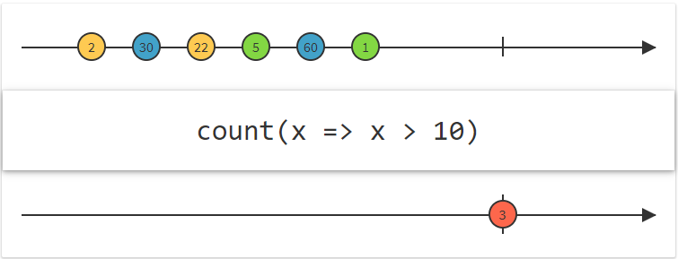

# Mathematical and aggregate operators
Operators that operate on the entire sequence of items emitted by an `Observable`.
- `Concat` — emit the emissions from two or more Observables without interleaving them;
- `Count` — count the number of items emitted by the source `Observable` and emit only this value;
- `Reduce` — apply a function to each item emitted by an `Observable`, sequentially, and emit the final value;

### [Concat](http://reactivex.io/documentation/operators/concat.html)
Emit the emissions from two or more Observables without interleaving them.

The *Concat* operator concatenates the output of multiple Observables so that they act like a single `Observable`, with all of the items emitted by the first `Observable` being emitted before any of the items emitted by the second `Observable` (and so forth, if there are more than two).

*Concat* waits to subscribe to each additional `Observable` that you pass to it until the previous `Observable` completes. Note that because of this, if you try to concatenate a "hot" `Observable`, that is, one that begins emitting items immediately and before it is subscribed to, *Concat* will not see, and therefore will not emit, any items that `Observable` emits before all previous Observables complete and Concat subscribes to the "hot" `Observable`.


```
fun concat() {
    val firstObservable = Observable.fromArray(arrayOf("A1", "A2", "A3"))
    val secondObservable = Observable.fromArray(arrayOf("B1", "B2", "B3"))

    Observable.concat(firstObservable, secondObservable)
            .subscribe(
                    { result -> println("Next item = ${result.toList()}") },
                    { println("onError") },
                    { println("onComplete") }
            )
}
```

Output:
```
Next item = [A1, A2, A3]
Next item = [B1, B2, B3]
```

### [Count](http://reactivex.io/documentation/operators/count.html)
Count the number of items emitted by the source `Observable` and emit only this value.

The *Count* operator transforms an `Observable` that emits items into an `Observable` that emits a single value that represents the number of items emitted by the source Observable.

If the source `Observable` terminates with an error, *Count* will pass this error notification along without emitting an item first. If the source `Observable` does not terminate at all, *Count* will neither emit an item nor terminate.



```
fun count() {
    Observable.just(12, 23, 35, 46, 57)
            .count()
            .subscribe(
                    { result -> println("Count = $result") },
                    { println("onError") }
            )
}
```

Output:
```
Count = 5
```

### [Reduce](http://reactivex.io/documentation/operators/reduce.html)
Apply a function to each item emitted by an `Observable`, sequentially, and emit the final value.

The *Reduce* operator applies a function to the first item emitted by the source `Observable` and then feeds the result of the function back into the function along with the second item emitted by the source `Observable`, continuing this process until the source `Observable` emits its final item and completes, whereupon the `Observable` returned from *Reduce* emits the final value returned from the function.

This sort of operation is sometimes called "accumulate", "aggregate", "compress", "fold", or "inject" in other contexts.


```
fun reduce() {
    Observable.range(1, 5)
            .reduce { firstNumber, secondNumber -> firstNumber * secondNumber }
            .subscribe(
                    { result -> println("Next item = $result") },
                    { println("onError") },
                    { println("onComplete") }
            )
}
```

Output:
```
Next item = 120
```

# Links
http://reactivex.io/documentation/operators.html  
http://reactivex.io/documentation/operators/concat.html  
http://reactivex.io/documentation/operators/count.html  
http://reactivex.io/documentation/operators/reduce.html
