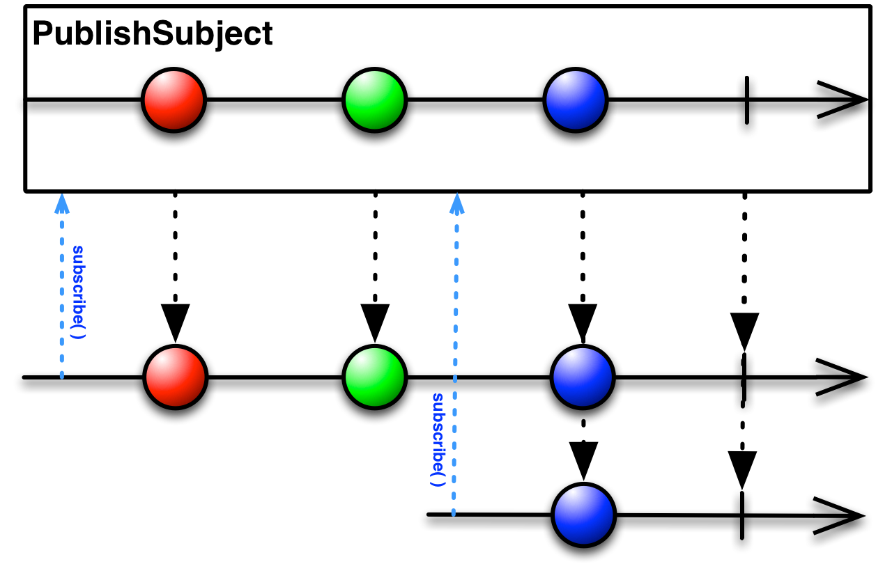
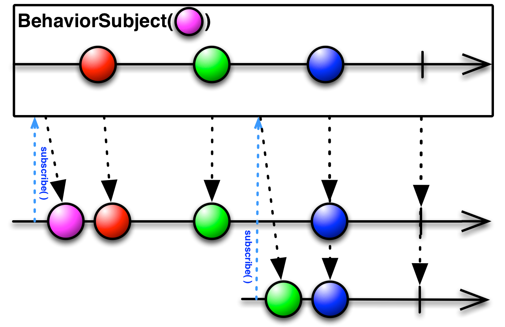

# Subjects Types

A *Subject* is a sort of bridge or proxy that is available in some implementations of ReactiveX that acts both as an observer and as an *Observable*. Because it is an observer, it can subscribe to one or more *Observables*, and because it is an *Observable*, it can pass through the items it observes by reemitting them, and it can also emit new items. 

The best way to use *Subjects* when you have an unknown number of sources and a single *Observable*. Subjects can be helpful for decoupling between *Observable* and *Observers*.

There are four types of subjects in RxJava: 
- `PublishSubject`
- `BehaviorSubject`
- `ReplaySubject`
- `AsyncSubject`

## PublishSubject

`PublishSubject` emits to an observer only those items that are emitted by the source *Observable(s)* subsequent to the time of the subscription.

Note that a `PublishSubject` may begin emitting items immediately upon creation (unless you have taken steps to prevent this), and so there is a risk that one or more items may be lost between the time the *Subject* is created and the observer subscribes to it. If you need to guarantee delivery of all items from the source *Observable*, you’ll need either to form that *Observable* with `Create` so that you can manually reintroduce “cold” *Observable* behavior (checking to see that all observers have subscribed before beginning to emit items), or switch to using a `ReplaySubject` instead.

If the source *Observable* terminates with an error, the `PublishSubject` will not emit any items to subsequent observers, but will simply pass along the error notification from the source *Observable*.

## BehaviorSubject

When an observer subscribes to a `BehaviorSubject`, it begins by emitting the item most recently emitted by the source *Observable* (or a seed/default value if none has yet been emitted) and then continues to emit any other items emitted later by the source *Observable(s)*.

However, if the source *Observable* terminates with an error, the `BehaviorSubject` will not emit any items to subsequent observers, but will simply pass along the error notification from the source *Observable*.

## ReplaySubject

`ReplaySubject` emits to any observer all of the items that were emitted by the source *Observable(s)*, regardless of when the observer subscribes.

There are also versions of `ReplaySubject` that will throw away old items once the replay buffer threatens to grow beyond a certain size, or when a specified timespan has passed since the items were originally emitted.

If you use a `ReplaySubject` as an observer, take care not to call its onNext method (or its other on methods) from multiple threads, as this could lead to coincident (non-sequential) calls, which violates the *Observable* contract and creates an ambiguity in the resulting *Subject* as to which item or notification should be replayed first.

## AsyncSubject

An `AsyncSubject` emits the last value (and only the last value) emitted by the source *Observable*, and only after that source *Observable* completes. (If the source `Observable` does not emit any values, the `AsyncSubject` also completes without emitting any values.)

It will also emit this same final value to any subsequent observers. However, if the source Observable terminates with an error, the `AsyncSubject` will not emit any items, but will simply pass along the error notification from the source *Observable*.

## Links
http://reactivex.io/documentation/subject.html    
https://medium.com/@nazarivanchuk/types-of-subjects-in-rxjava-96f3a0c068e4   
https://proandroiddev.com/rxjava-different-types-of-subjects-ef9183b5e87e    
http://introtorx.com/Content/v1.0.10621.0/02_KeyTypes.html#AsyncSubject  
http://introtorx.com/Content/v1.0.10621.0/02_KeyTypes.html#BehaviorSubject  
http://introtorx.com/Content/v1.0.10621.0/02_KeyTypes.html#ReplaySubject  
