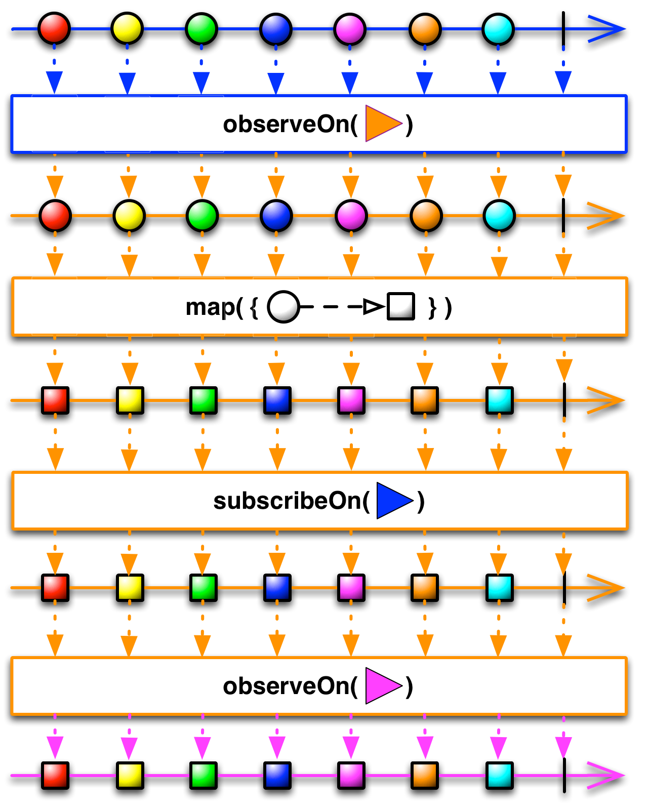

# SubscribeOn
`SubscribeOn` specify the Scheduler on which an Observable will operate.


Many implementations of ReactiveX use “Schedulers” to govern an Observable’s transitions between threads in a multi-threaded environment. You can instruct an `Observable` to do its work on a particular Scheduler by calling the Observable’s `SubscribeOn` operator.



By default, an Observable and the chain of operators that you apply to it will do its work, and will notify its observers, on the same thread on which its `Subscribe` method is called. The `SubscribeOn` operator changes this behavior by specifying a different Scheduler on which the `Observable` should operate. The `ObserveOn` operator specifies a different Scheduler that the `Observable` will use to send notifications to its observers.

As shown in this illustration, the `SubscribeOn` operator designates which thread the `Observable` will begin operating on, no matter at what point in the chain of operators that operator is called. `ObserveOn`, on the other hand, affects the thread that the `Observable` will use below where that operator appears. For this reason, you may call `ObserveOn` multiple times at various points during the chain of `Observable` operators in order to change on which threads certain of those operators operate.

Example:
```
fun subscribeOn() {
        Observable.create<Int> {
            it.onNext(1)
            it.onComplete()
        }
        .subscribeOn(Schedulers.newThread())
        .subscribe { println("Subscriber on ${Thread.currentThread().name}") }
}
```

Output:
```
Subscriber on RxNewThreadScheduler-1
```

# Links
[SubscribeOn](http://reactivex.io/documentation/operators/subscribeon.html)

# Further reading
[RxJava2 subscribeOn: How to use it](https://www.glureau.com/2020/05/02/RxJava-SubscribeOn-HowTo/)