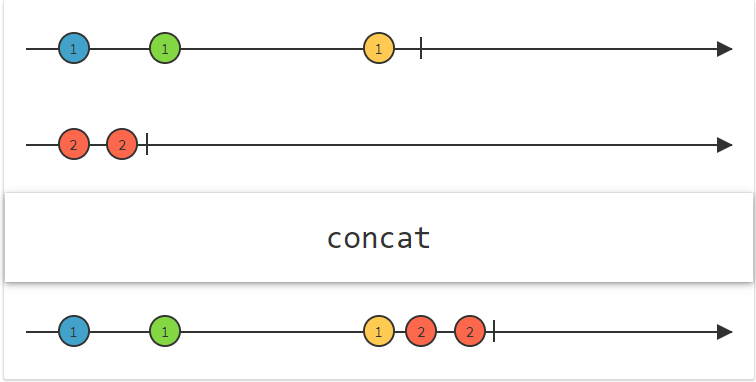
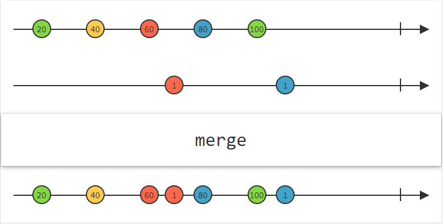

# Concat vs Merge

## Concat

Emit the emissions from two or more Observables without interleaving them. 



The Concat operator concatenates the output of multiple Observables so that they act like a single Observable, with all of the items emitted by the first Observable being emitted before any of the items emitted by the second Observable (and so forth, if there are more than two).

Concat waits to subscribe to each additional Observable that you pass to it until the previous Observable completes. Note that because of this, if you try to concatenate a “hot” Observable, that is, one that begins emitting items immediately and before it is subscribed to, Concat will not see, and therefore will not emit, any items that Observable emits before all previous Observables complete and Concat subscribes to the “hot” Observable.

```
String[] firstSource = { "first1", "first2", "first3", "first4" };
String[] secondSource = { "second1", "second2", "second3", "second4" };

Observable<String> firstObservable = Observable.fromArray(firstSource);
Observable<String> secondObservable = Observable.fromArray(secondSource);

Observable.concat(firstObservable, secondObservable)
        .subscribe(new Observer<String>() {

            @Override
            public void onSubscribe(Disposable d) {
                
            }

            @Override
            public void onNext(String value) {

            }

            @Override
            public void onError(Throwable e) {

            }

            @Override
            public void onComplete() {

            }
        });
```

Output: 

```
first1, first2, first3, first4, second1, second2, second3, second4 
```

## Merge

Combine multiple Observables into one by merging their emissions



`Merge` combine the output of multiple Observables so that they act like a single Observable, but it won’t maintain the sequential execution.

```
String[] firstSource = { "first1", "first2", "first3", "first4" };
String[] secondSource = { "second1", "second2", "second3", "second4" };

Observable<String> firstObservable = Observable.fromArray(firstSource);
Observable<String> secondObservable = Observable.fromArray(secondSource);

Observable.concat(firstObservable, secondObservable)
        .subscribe(new Observer<String>() {

            @Override
            public void onSubscribe(Disposable d) {
                
            }

            @Override
            public void onNext(String value) {

            }

            @Override
            public void onError(Throwable e) {

            }

            @Override
            public void onComplete() {

            }
        });
```

Output (may be in any order): 

```
first1, second`, first2, second2, first3, second3, first4, second4
```

## Links
http://reactivex.io/documentation/operators/concat.html  
http://reactivex.io/documentation/operators/merge.html  
https://www.androidhive.info/RxJava/rxjava-operators-concat-merge/  
