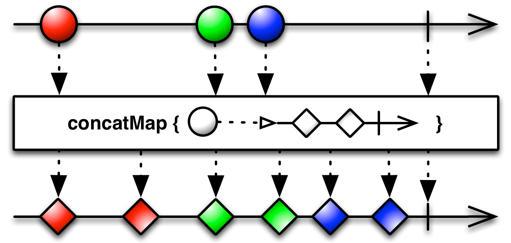
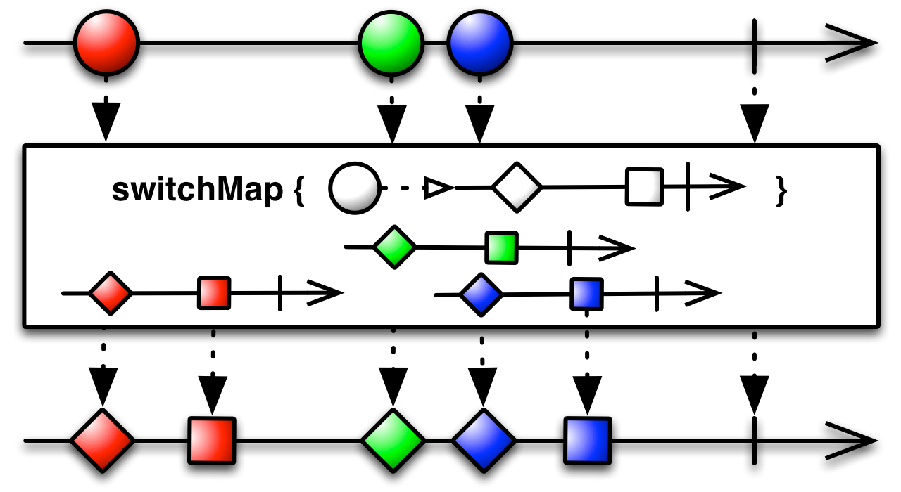

# flatMap() vs concatMap() vs switchMap()

## FlatMap

Transform the items emitted by an Observable into Observables, then flatten the emissions from those into a single Observable.

The FlatMap operator transforms an Observable by applying a function that you specify to each item emitted by the source Observable, where that function returns an Observable that itself emits items. FlatMap then merges the emissions of these resulting Observables, emitting these merged results as its own sequence.

This method is useful, for example, when you have an Observable that emits a series of items that themselves have Observable members or are in other ways transformable into Observables, so that you can create a new Observable that emits the complete collection of items emitted by the sub-Observables of these items.

**Note**: FlatMap merges the emissions of these Observables and not care about the order of the items!

## ConcatMap

Simillar to `flatMap()` but `concatMap()` maintains the order of items and waits for the current Observable to complete its job before emitting the next one.

Another difference between `flatMap()` and `concatMap()` operators. The `flatMap()` uses `merge` operator implicitly whereas `concatMap()` uses `concat` operator.

## SwitchMap

Similar to `flatMap()`, except that it retains the result of only the latest observable, discarding the previous ones.

`switchMap()`would emit only the latest observable after a particular delay. It ignores all the previous ones.

## Links
http://reactivex.io/documentation/operators/flatmap.html  
https://www.journaldev.com/19300/rxjava-flatmap-switchmap-concatmap  
https://www.androidhive.info/RxJava/map-flatmap-switchmap-concatmap/  
https://www.baeldung.com/rxjava-flatmap-switchmap  
https://medium.com/appunite-edu-collection/rxjava-flatmap-switchmap-and-concatmap-differences-examples-6d1f3ff88ee0  
