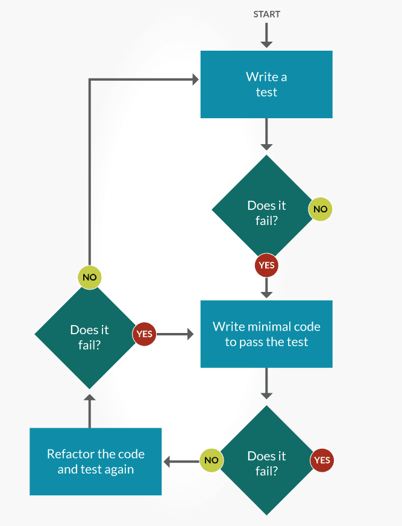

# Test Driven Development (TDD)
**Test-driven development (TDD)** is a software development process that relies on the repetition of a very short development cycle: requirements are turned into very specific test cases, then the code is improved so that the tests pass. This is opposed to software development that allows code to be added that is not proven to meet requirements.

## Test-driven development cycle
- **Add a test**. 
In test-driven development, each new feature begins with writing a test. Write a test that defines a function or improvements of a function, which should be very succinct. To write a test, the developer must clearly understand the feature's specification and requirements. The developer can accomplish this through use cases and user stories to cover the requirements and exception conditions, and can write the test in whatever testing framework is appropriate to the software environment. It could be a modified version of an existing test. This is a differentiating feature of test-driven development versus writing unit tests after the code is written: it makes the developer focus on the requirements before writing the code, a subtle but important difference.
- **Run all tests and see if the new test fails**. 
This validates that the test harness is working correctly, shows that the new test does not pass without requiring new code because the required behavior already exists, and it rules out the possibility that the new test is flawed and will always pass. The new test should fail for the expected reason. This step increases the developer's confidence in the new test.
- **Write the code**. 
The next step is to write some code that causes the test to pass. The new code written at this stage is not perfect and may, for example, pass the test in an inelegant way. That is acceptable because it will be improved and honed in Step 5.
At this point, the only purpose of the written code is to pass the test. The programmer must not write code that is beyond the functionality that the test checks.
- **Run tests**.
If all test cases now pass, the programmer can be confident that the new code meets the test requirements, and does not break or degrade any existing features. If they do not, the new code must be adjusted until they do.
- **Refactor code**.
The growing code base must be cleaned up regularly during test-driven development. New code can be moved from where it was convenient for passing a test to where it more logically belongs. Duplication must be removed. Object, class, module, variable and method names should clearly represent their current purpose and use, as extra functionality is added. As features are added, method bodies can get longer and other objects larger. 
- **Repeat** 
Starting with another new test, the cycle is then repeated to push forward the functionality. The size of the steps should always be small, with as few as 1 to 10 edits between each test run. If new code does not rapidly satisfy a new test, or other tests fail unexpectedly, the programmer should undo or revert in preference to excessive debugging.

## Benefits of TDD
- Tests will be automated, saving a lot of time compared to manually testing functionality.
- Tests are created for each bug. These tests will be run each time there is another bug fix, to make sure bugs don’t reoccur in the code.
- Time allocated for regression testing can be reduced considerably.
- Tests written ahead of time will also ensure good code quality.
- Writing tests, followed by minimum code changes after each test run, will make sure there is good unit test coverage for the software, which will again contribute to the overall quality of the product.

## Pitfalls of TDD
- May not be right for developers who mostly work with a non-TDD approach.
- Not having enough knowledge on unit test framework will also impact TDD approach.
- Complex scenarios requiring a greater time investment for creating these tests.
- Rapidly changing requirements makes creation and maintenance of these tests onerous.

## Links
https://en.wikipedia.org/wiki/Test-driven_development  
https://blog.testlodge.com/what-is-tdd/  
https://dzone.com/articles/introduction-to-java-tdd  
