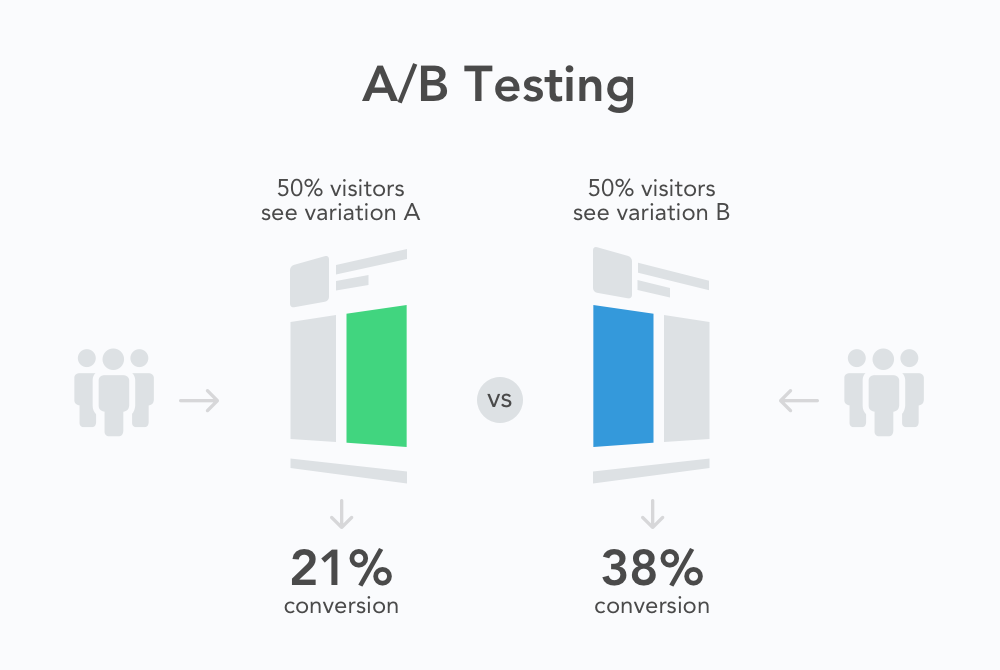

# A/B testing
**A/B testing** (also known as **bucket testing** or **split-run testing**) is a user experience research methodology. A/B tests consist of a randomized experiment with two variants, A and B. It includes application of statistical hypothesis testing or "two-sample hypothesis testing" as used in the field of statistics. A/B testing is a way to compare two versions of a single variable, typically by testing a subject's response to variant A against variant B, and determining which of the two variants is more effective.

A/B test is the shorthand for a simple controlled experiment. As the name implies, two versions (A and B) of a single variable are compared, which are identical except for one variation that might affect a user's behavior. A/B tests are widely considered the simplest form of controlled experiment. A/B tests are useful for understanding user engagement and satisfaction of online features, such as a new feature or product.

## How A/B Testing Works

Every test begins with the formation of the hypothesis. The classic example of this might be ‘Sign Up’ vs. ‘Register’ links or ‘Red’ vs. ‘Green’ buttons. Once the goal (e.g. installs) and options for the test are determined, the tester starts driving users to the pages. All user traffic is randomly distributed between the control version and the other variations. Visitors should be unaware of their participation in the experiment. If one variant performs significantly better than the others, it can be considered as a winner and should be applied.

You’ll see it being used to compare smaller elements such as styles of call-to-action buttons and larger components as well like the site’s overall design. However, A/B testing works just as well, if not better, for mobile apps. Often overlooked by mobile developers, this tool may be used to determine the effectiveness of icons, screenshots, descriptions, store search results, directions, prices, headlines, and more.

## How to Run an A/B Test
- **Perform Research**. Determine your objective. Whatever you’re testing should lead to a greater goal such as higher conversion rates. Ideally, A/B testing will help you solve an issue with your app and drive your business goals to success.
- **Determine Your Variants**. What is it that you want to compare? Identify a problem you’d like to solve. It may be an element of design, copy, or function.
- **Perform the Test**. Once you’ve formulated your theory and identified the element that you want to A/B test, you need to create two variations of the landing page. (Let’s call them A and B.) They should be exactly the same, the only difference being the element that you want to test (icon, screenshot, description, etc.) 
  
  Once you have the two pages ready, you need to identify your audience and drive them to these pages (directing 50% of visitors to page A and the other 50% to page B). You then measure how many installs each version generates to determine the winner.
- **Analyze Data and Review Results**. There’s a number of factors to consider including: time on page, interactions with different elements of your app’s page (screenshots, descriptions, etc.), scroll depth and more. But ultimately you should be looking at how many people tap the ‘Install’ button as this is your top goal.
- **Make Changes Based on Results**. If you do have a clear cut winner, go ahead and start making changes based on the results you’ve generated. In the case of testing the app icon, you would now update the design to reflect the winner of your A/B test. If a higher price yields more revenue, then you can consider updating your pricing.
- **Prepare for Follow-Up Tests**. A/B testing does not exist in a vacuum, and it’s hardly ever a one and done deal. Conversion optimization is an ongoing process with no ending. Always run experiments to determine how you can furt

# Links
[A/B testing](https://en.wikipedia.org/wiki/A/B_testing)

[What is A/B Testing and Why It Matters for Mobile Developers](https://splitmetrics.com/resources/what-is-ab-testing-and-why-it-matters-for-mobile-developers/)

# Futher reading
[A/B Testing](https://www.optimizely.com/optimization-glossary/ab-testing/)
